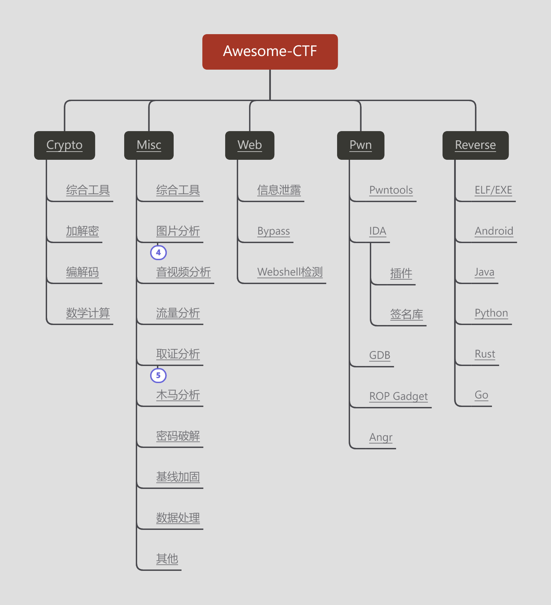

# Awesome-CTF

**【免责声明】本项目所涉及的技术、思路和工具仅供学习，任何人不得将其用于非法用途和盈利，不得将其用于非授权渗透测试，否则后果自行承担，与本项目无关。使用本项目前请先阅读 [法律法规](https://github.com/Threekiii/Awesome-Laws)。**

## Roadmap

## 目录

- [First of All](#first-of-all)
- [开源导航](#%E5%BC%80%E6%BA%90%E5%AF%BC%E8%88%AA)
- [Crypto](#crypto)
	- [综合工具](#%E7%BB%BC%E5%90%88%E5%B7%A5%E5%85%B7)
	- [加解密](#%E5%8A%A0%E8%A7%A3%E5%AF%86)
	- [编解码](#%E7%BC%96%E8%A7%A3%E7%A0%81)
	- [数学计算](#%E6%95%B0%E5%AD%A6%E8%AE%A1%E7%AE%97)
- [Misc](#misc)
	- [综合工具](#%E7%BB%BC%E5%90%88%E5%B7%A5%E5%85%B7)
	- [图片分析](#%E5%9B%BE%E7%89%87%E5%88%86%E6%9E%90)
		- [图片隐写](#%E5%9B%BE%E7%89%87%E9%9A%90%E5%86%99)
		- [图片EXIF](#%E5%9B%BE%E7%89%87exif)
		- [图片杂项](#%E5%9B%BE%E7%89%87%E6%9D%82%E9%A1%B9)
		- [二维码](#%E4%BA%8C%E7%BB%B4%E7%A0%81)
	- [音视频分析](#%E9%9F%B3%E8%A7%86%E9%A2%91%E5%88%86%E6%9E%90)
	- [流量分析](#%E6%B5%81%E9%87%8F%E5%88%86%E6%9E%90)
	- [取证分析](#%E5%8F%96%E8%AF%81%E5%88%86%E6%9E%90)
		- [磁盘取证](#%E7%A3%81%E7%9B%98%E5%8F%96%E8%AF%81)
		- [内存取证](#%E5%86%85%E5%AD%98%E5%8F%96%E8%AF%81)
		- [日志取证](#%E6%97%A5%E5%BF%97%E5%8F%96%E8%AF%81)
		- [浏览器取证](#%E6%B5%8F%E8%A7%88%E5%99%A8%E5%8F%96%E8%AF%81)
		- [鼠标/键盘取证](#%E9%BC%A0%E6%A0%87%E9%94%AE%E7%9B%98%E5%8F%96%E8%AF%81)
	- [木马分析](#%E6%9C%A8%E9%A9%AC%E5%88%86%E6%9E%90)
	- [密码破解](#%E5%AF%86%E7%A0%81%E7%A0%B4%E8%A7%A3)
	- [基线加固](#%E5%9F%BA%E7%BA%BF%E5%8A%A0%E5%9B%BA)
	- [数据处理](#%E6%95%B0%E6%8D%AE%E5%A4%84%E7%90%86)
	- [其他](#%E5%85%B6%E4%BB%96)
- [Web](#web)
	- [信息泄露](#%E4%BF%A1%E6%81%AF%E6%B3%84%E9%9C%B2)
	- [Bypass](#bypass)
	- [Webshell检测](#webshell%E6%A3%80%E6%B5%8B)
- [Pwn](#pwn)
	- [Pwntools](#pwntools)
	- [IDA](#ida)
		- [插件](#%E6%8F%92%E4%BB%B6)
		- [签名库](#%E7%AD%BE%E5%90%8D%E5%BA%93)
	- [GDB](#gdb)
	- [ROP Gadget](#rop-gadget)
	- [Angr](#angr)
- [Reverse](#reverse)
	- [ELF/EXE](#elfexe)
	- [Android](#android)
	- [Java](#java)
	- [Python](#python)
	- [Rust](#rust)
	- [Go](#go)

## First of All

CTF 常见竞赛模式:

- 理论知识: 通常为选择题。
- 解题模式: 通常分为 Crypto、Misc、Web、Pwn、Reverse 五个类别。
- AWD 模式: Attack with Defense，通常仅包含 Web 及 Pwn 两个类别。
- AWD Plus 模式: Attack with Defence Plus，通常为解题（攻击）+ 加固（防御）。
- RHG 模式: Robot Hacking Game，通常为使用自动化攻击程序实现对漏洞的全自动挖掘及漏洞。

18 年以后的其他新竞赛模式:

- Real World CTF
- King of The Hill

## 开源导航

- CTF Wiki: https://ctf-wiki.org/
- CTF Hub: https://www.ctfhub.com/
- CTF Time: https://ctftime.org/
- AWD-Guide: https://github.com/AabyssZG/AWD-Guide
- 攻防世界: https://adworld.xctf.org.cn/
- Hacker 101: https://www.hacker101.com/
- Cryptopals: 密码学练习题目 https://cryptopals.com/
- Awesome-ctf: https://github.com/apsdehal/awesome-ctf
- CTF Tools: https://github.com/zardus/ctf-tools
- ~~近期赛事-https://su-sanha.cn/events/ API-http://event.ctf.probius.xyz/cn_CTF ~~（貌似不再维护）

## Writeups Collection

- CTF writeups from P4 Team: https://github.com/p4-team/ctf

## Crypto

*Tools used for solving Crypto challenges.*

### 综合工具

- 在线工具：
	- http://www.ip33.com/
	- https://evilcos.me/lab/xssee/
	- http://www.metools.info/
	- https://www.107000.com/
	- https://github.com/wangyiwy/oktools
	- http://www.hiencode.com/
	- http://www.atoolbox.net/
	- https://www.sojson.com/
	- https://the-x.cn/
- 离线工具：
	- Ciphey: https://github.com/Ciphey/Ciphey python
	- CyberChef: https://github.com/gchq/CyberChef web
	- ctfcode: http://1o1o.xyz/bo_ctfcode.html
	- CaptfEncoder: https://github.com/guyoung/CaptfEncoder

### 加解密

- 摩斯电码: http://moersima.00cha.net/
- 摩斯电码: http://www.zhongguosou.com/zonghe/moersicodeconverter.aspx
- 栅栏密码: https://www.qqxiuzi.cn/bianma/zhalanmima.php
- 猪圈密码: http://www.hiencode.com/pigpen.html
- 零宽字符: http://330k.github.io/misc_tools/unicode_steganography.html
- quipqiup: 在线古典密码词频爆破 https://www.quipqiup.com/
- rabbit: https://asecuritysite.com/encryption/rabbit2
- MD5:
	- https://www.cmd5.org/
	- https://www.somd5.com/
	- https://www.onlinehashcrack.com/
	- https://crackstation.net/
	- https://crack.sh/
	- https://passwordrecovery.io/
	- https://md5decrypt.net/en/Sha256/
	- https://hashes.com/en/decrypt/hash
- RSA:
	- https://www.ssleye.com/ssltool/
	- https://www.lddgo.net/en/encrypt/rsa work with .pem
- 加密算法模板: https://github.com/a568972484/The_encryption_template_Python

### 编解码

- Unicode: https://www.compart.com/en/unicode/
- GB2312: http://code.mcdvisa.com/
- UUencode: http://web.chacuo.net/charsetuuencode
- XXencode: 输入文本以每三个字节为单位进行编码 http://web.chacuo.net/charsetxxencode
- Escape/Unescape: https://tool.chinaz.com/tools/escape.aspx
- HTML 实体编码: https://zh.rakko.tools/tools/21/
- Base64 填充位隐写读取: https://github.com/cjcslhp/wheels/tree/master/b64stego

### 数学计算

- yafu: RSA 解题中的因式分解 https://github.com/bbuhrow/yafu
- factordb: 在线大数分解数据库 http://factordb.com/
- 在线求解线性方程组: http://www.yunsuan.info/matrixcomputations/solvelinearsystems.html
- 数独求解器: https://shudu.gwalker.cn/

## Misc

*Tools used for solving Misc challenges.*

### 综合工具

- PuzzleSolver: Misc 工具 https://github.com/Byxs20/PuzzleSolver

### 图片分析

#### 图片隐写

- Stegsolve: 图片隐写查看器 http://www.caesum.com/handbook/stego.ht
- Stegonline: Stegsolve 在线版 https://stegonline.georgeom.net/upload
- F5-steganography: 隐写工具 jpg https://github.com/matthewgao/F5-steganography
- OutGuess: 隐写工具 jpg https://github.com/crorvick/outguess
- Silenteye: 隐写工具 jpg https://achorein.github.io/silenteye/
- zsteg: 检测 png 和 bmp 图片隐写数据 https://github.com/zed-0xff/zsteg
- PNGDebugger: 读取 png 文件头，检查 CRC https://github.com/rvong/png-debugger#pngdebugger
- cloacked-pixel: LSB 隐写工具 png https://github.com/livz/cloacked-pixel
- LSB-Steganography: LSB 隐写工具 png https://github.com/RobinDavid/LSB-Steganography

#### 图片 EXIF

- 图虫在线 EXIF 查看器: https://exif.tuchong.com/
- EXIF 查看器: exiftool https://exiftool.org/
- Magicexif 元数据编辑器: https://www.magicexif.com/
- TweakPNG: png 图像编辑器，修改元数据 https://entropymine.com/jason/tweakpng/

#### 图片杂项

- Ezgif: 在线分帧 https://ezgif.com/split
- 盲水印提取: https://github.com/chishaxie/BlindWaterMark
- OCR 在线识别: https://web.baimiaoapp.com/
- 解决拼图问题: montage+gaps https://github.com/nemanja-m/gaps

#### 二维码

- 在线绘制二维码/汉信码: https://www.pixilart.com/draw?ref=home-page
- 在线绘制二维码: https://merricx.github.io/qrazybox/
- 在线扫描一维码: https://online-barcode-reader.inliteresearch.com/

### 音视频分析

- Audacity: 音频隐写 https://www.audacityteam.org/
- Mp3Stego: Mp3 音频隐写 https://www.petitcolas.net/steganography/mp3stego/
- RX-SSTV: 145.800Mhz 频率信号解码 音频→图片 https://www.qsl.net/on6mu/rxsstv.htm

### 流量分析

- Pcap 流量包在线修复: http://f00l.de/hacking/pcapfix.php
- knm: 鼠标键盘流量包取证 https://github.com/FzWjScJ/knm
- PCredz: Extract information from pcap https://github.com/lgandx/PCredz

### 取证分析

_Tools used for solving Forensics challenges_.

#### 磁盘取证

- DiskGenius: 磁盘取证工具 https://www.diskgenius.cn/
- Sleuth Kit: 磁盘取证工具 https://github.com/sleuthkit/sleuthkit
- Autopsy: 磁盘取证浏览器 https://www.autopsy.com/
- AccessData FTK Imager: ad1 镜像格式取证 https://www.exterro.com/digital-forensics-software/ftk-imager
- ElcomSoft Distributed Password Recovery: BitLocker 解密 https://www.elcomsoft.com/edpr.html
- Elcomsoft Forensic Disk Decryptor: https://www.elcomsoft.com/efdd.html

#### 内存取证

- Volatility: 内存取证工具 https://github.com/volatilityfoundation/volatility
- Volatility3: https://github.com/volatilityfoundation/volatility3
- GIMP: 开源图像编辑器 配合 Volatility 导出的.dmp 使用 https://www.gimp.org/
- pyvmx-cracker: .vmx 密码破解 https://github.com/axcheron/pyvmx-cracker
- VMwareVMX: .vmx 配置数据解密 https://github.com/RF3/VMwareVMX

#### 日志取证

- LogForensics: web 日志取证分析工具 https://security.tencent.com/index.php/opensource/detail/15
- ProcessMonitor: 进程监视器 https://learn.microsoft.com/zh-cn/sysinternals/downloads/procmon
- Event log explorer: 日志查看器 https://www.eventlogxp.com/
- LogonTracer: Windows Active Directory 事件日志分析 https://github.com/JPCERTCC/LogonTracer

#### 浏览器取证

- hindsight: Chrome/Chromium 取证 https://github.com/obsidianforensics/hindsight
- HackBrowserData: 浏览器导出解密 https://github.com/moonD4rk/HackBrowserData

#### 鼠标/键盘取证

- knm: 鼠标键盘流量包取证 https://github.com/FzWjScJ/knm
- UsbKeyboardDataHacker: USB 键盘流量包取证 https://github.com/WangYihang/UsbKeyboardDataHacker
- USB-Mouse-Pcap-Visualizer: USB 鼠标流量包取证 https://github.com/WangYihang/USB-Mouse-Pcap-Visualizer

### 木马分析

- CS_Decrypt: CobaltStrike 流量解密 https://github.com/5ime/CS_Decrypt
- godzilla_decryptor: Godzilla 流量解密 https://github.com/Threekiii/Awesome-Redteam/blob/master/scripts/Godzilla_Decryptor/godzilla_decryptor.py
- BlueTeamTools: 综合工具 冰蝎 1.x-3.x Godzilla1.x-4.x 流量解密 https://github.com/abc123info/BlueTeamTools

### 密码破解

_Tools used for various kind of bruteforcing (passwords etc.)_

- crunch: 字典生成
	- Kali/Linux: https://sourceforge.net/projects/crunch-wordlist
	- Windows: https://github.com/shadwork/Windows-Crunch
- pydictor: 字典生成 md5 计算 https://github.com/LandGrey/pydictor/blob/master/README_CN.md
- aircrack-ng: 破解 wifi 密码 https://github.com/aircrack-ng/aircrack-ng
- Advanced Office Password Recovery（AOPR）: 破解 office 文档密码 https://www.elcomsoft.com/aopr.html
- Advanced Archive Password Recovery（ARCHPR）: 破解 zip 和 rar 文件密码 https://www.elcomsoft.com/archpr.html
- crc32: CRC32 爆破 https://github.com/theonlypwner/crc32
- ZipCenOp: zip 伪加密破解
- Ziperello: zip 压缩包密码破解
- c-jwt-cracker: JWT Token 爆破 https://github.com/brendan-rius/c-jwt-cracker
- how-does-Xmanager-encrypt-password: Xmanager 密码解密 https://github.com/HyperSine/how-does-Xmanager-encrypt-password
- SharpXDecrypt: Xshell 全版本密码恢复 https://github.com/JDArmy/SharpXDecrypt
- navicat_password_decrypt: Navicat 密码恢复 注册表 or .ncx https://github.com/Zhuoyuan1/navicat_password_decrypt

### 数据处理

- 010 Editor: https://www.sweetscape.com/010editor/
  - 010 Editor 插件模板下载: 例如 ELF.bt https://www.sweetscape.com/010editor/repository/templates/
- Binwalk: https://github.com/ReFirmLabs/binwalk
- 在线十六进制编辑器: https://hexed.it/
- 在线正则表达式: https://c.runoob.com/front-end/854/
- 在线正则表达式: https://regex101.com/
- 在线正则英语单词: https://regdict.com/

### 其他

- QEMU: 物联网固件仿真 https://wiki.qemu.org/Documentation
- 挖矿收益计算器: https://minersns.com/tools/jsqlist

## Web

### 信息泄露

- GitHack: .git 泄露利用脚本 https://github.com/lijiejie/GitHack python3 有时无法恢复.git 目录，推荐 python2 版本
- GitHack: .git 泄露利用脚本 https://github.com/BugScanTeam/GitHack python2
- dvcs-ripper: .svn、.hg、.cvs 泄露利用脚本 https://github.com/kost/dvcs-ripper
- ds_store_exp: .DS_Store 文件泄漏利用脚本 https://github.com/lijiejie/ds_store_exp

### Webshell 排查

- https://www.d99net.net/
- https://github.com/jvoisin/php-malware-finder

### Bypass

- localhost 绕过: 127.0.0.1 >>> 2130706433 https://www.browserling.com/tools/ip-to-dec

## Pwn

### Pwntools

- Pwntools: CTF 框架和漏洞利用开发库 https://github.com/Gallopsled/pwntools

### IDA

#### 插件

- idaplugins-list: IDA 插件 https://github.com/onethawt/idaplugins-list

#### 签名库

- sig-database: IDA FLIRT 签名库 https://github.com/push0ebp/sig-database
- FLIRTDB: IDA FLIRT 签名库 https://github.com/Maktm/FLIRTDB

### GDB

- Pwndbg: GDB 插件 https://github.com/pwndbg/pwndbg
- gdb-dashboard: GDB 插件 https://github.com/cyrus-and/gdb-dashboard

### ROP Gadget

- ROPgadget: 返回导向式编程 寻找 Gadget https://github.com/JonathanSalwan/ROPgadget
- Ropper: 返回导向式编程 寻找 Gadget https://github.com/sashs/Ropper

### Angr

- Angr: 符号执行 https://docs.angr.io/ 官方实例: https://docs.angr.io/en/latest/examples.html

## Reverse

### ELF/EXE

- Cutter: https://cutter.re/
- IDA: https://hex-rays.com/ida-pro/
- x64DBG: https://x64dbg.com/
- Ollydbg: https://www.ollydbg.de/
- bindiff: 二进制比对工具 https://www.zynamics.com/software.html
- angr: 二进制分析 https://github.com/angr/angr
- ExeinfoPE: 查壳工具 https://github.com/ExeinfoASL/ASL
- PEiD: 查壳工具 https://www.aldeid.com/wiki/PEiD
- UPX: UPX 脱壳工具 https://github.com/upx/upx

### Android

- jadx: https://github.com/skylot/jadx
- JEB: https://www.pnfsoftware.com/
- GDA: https://github.com/charles2gan/GDA-android-reversing-Tool

### Java

- jd-gui: https://github.com/java-decompiler/jd-gui

### Python

- py2exe: 打包工具 https://www.py2exe.org/
- pyInstaller: 打包工具 https://pyinstaller.org/
- unpy2exe: py2exe 打包程序中提取 .pyc https://github.com/matiasb/unpy2exe
- pyinstxtractor: pyInstaller 打包程序中提取 .pyc https://github.com/extremecoders-re/pyinstxtractor
- uncompyle6: 字节码文件（.pyc）反编译为源代码（.py） https://github.com/rocky/python-uncompyle6/

### Rust

- rust-reversing-helper: https://github.com/cha5126568/rust-reversing-helper

### Go

- golang_loader_assist: https://github.com/strazzere/golang_loader_assist
- IDAGolangHelper: https://github.com/sibears/IDAGolangHelper

### .NET

- dotPeek: https://www.jetbrains.com/zh-cn/decompiler/
- dnSpy: https://github.com/dnSpy/dnSpy
