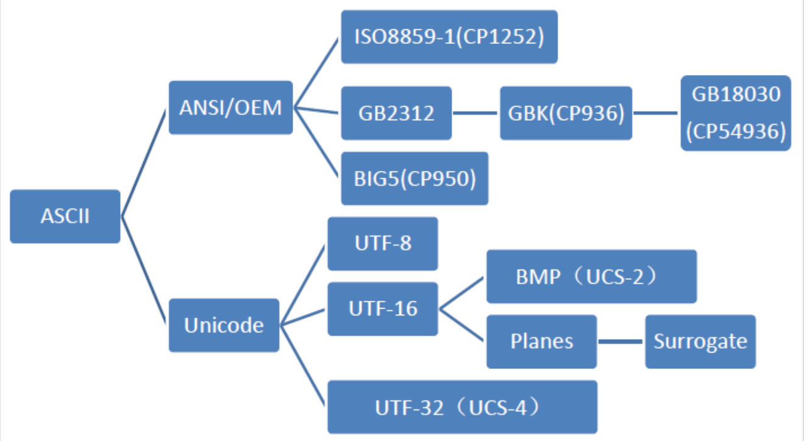

# 编解码及加解密

```
flag{whoami_WHOAMI_12345_Wh0am1}
```

## 常见编解码
### Base 编码

> base16、base32、base36、base58、base62、base64、base85、base91、base92、base100

- base16：大写字母(A-Z)和数字(0-9)，不用'='补齐。
- base32：大写字母(A-Z)和数字(2-7)，不满5的倍数，用'='补齐。
- base58：相比 base64，base58 不使用数字'0'，字母大写'O'，字母大写'I'，和字母小写'l'，以及'+'和'/'符号，后面不会出现'='。
- base64：大小写字母（A-Z，a-z）和数字（0-9）以及特殊字符'+'和'/'，不满3的倍数，用'='补齐。
- base91：由91个字符（0-9，a-z，A-Z,!#$%&()*+,./:;<=>?@[]^_`{|}~”）组成
不支持中文。
- base100：emoji符号。

```
文本: flag{whoami_WHOAMI_12345_Wh0am1}
```

```
base16: 666C61677B77686F616D695F57484F414D495F31323334355F576830616D317D
特征：大写字母(A-Z)和数字(0-9)，不用'='补齐。
```

```
base32: MZWGCZ33O5UG6YLNNFPVOSCPIFGUSXZRGIZTINK7K5UDAYLNGF6Q====
特征：大写字母(A-Z)和数字(2-7)，不满5的倍数，用'='补齐。
```

```
base36(仅支持整数): 123456789009876543211357924680148259 -> 74jlhdl6saa0chq7lhip3qb
```

```
base58: 7tpSNVKzm4ew3vCTof1oga1rGn4CV4xyZ535RXenYYHz
base58 BTC: 7TPrnujZL4DW3VcsNE1NFz1RgM4cu4XYy535qwDMxxhZ
特征：相比 base64，base58 不使用数字'0'，字母大写'O'，字母大写'I'，和字母小写'l'，以及'+'和'/'符号，后面不会出现'='。
```

```
base62(仅支持整数): 123456789009876543211357924680148259 -> aRHcZav6RcnMIXswRTQn
```

```
base64: ZmxhZ3t3aG9hbWlfV0hPQU1JXzEyMzQ1X1doMGFtMX0=
特征：大小写字母（A-Z，a-z）和数字（0-9）以及特殊字符'+'和'/'，不满3的倍数，用'='补齐。
```

```
base85: Ao(mgHZs.A@;T^c=%H+Q9hA\H1,CaE?WUnp@;R`I
特征：特点是奇怪的字符比较多，但是很难出现等号。
```

```
base91: @iH<,{5v2$;#k^%e"qWcyz%H<1m/J[%eOuEf*i)C
特征：由91个字符（0-9，a-z，A-Z,!#$%&()*+,./:;<=>?@[]^_`{|}~”）组成
不支持中文。
```

```
base92: F#S<YRe!QKgQAh{1;Ht\\4a_g(eF#&a{1F\\&;bUe}
```

```
base100: 
👝👣👘👞👲👮👟👦👘👤👠👖👎🐿👆🐸👄👀👖🐨🐩🐪🐫🐬👖👎👟🐧👘👤🐨👴
特征：emoji表情
```

### ASCII 编码

由ASCII发展而来的各个字符集和编码的分支：




ASCII 码是对英语字符与二进制位之间的关系，做了统一规定。

基本的 ASCII 字符集共有 128 个字符，其中有 96 个可打印字符，包括常用的字母、数字、标点符号等，

​ 特征： 只含有数字

- 0-9, 49-57
- A-Z, 65-90
- a-z, 97-122

```
文本: flag{whoami_WHOAMI_12345_Wh0am1}
```

```
二进制：
01100110 01101100 01100001 01100111 01111011 01110111 01101000 01101111 01100001 01101101 01101001 01011111 01010111 01001000 01001111 01000001 01001101 01001001 01011111 00110001 00110010 00110011 00110100 00110101 01011111 01010111 01101000 00110000 01100001 01101101 00110001 01111101

十进制：
102 108 97 103 123 119 104 111 97 109 105 95 87 72 79 65 77 73 95 49 50 51 52 53 95 87 104 48 97 109 49 125

十六进制(0x66 0x6c)：
66 6c 61 67 7b 77 68 6f 61 6d 69 5f 57 48 4f 41 4d 49 5f 31 32 33 34 35 5f 57 68 30 61 6d 31 7d

UTF-16（\uXXXX）: 
\u0066\u006C\u0061\u0067\u007B\u0077\u0068\u006F\u0061\u006D\u0069\u005F\u0057\u0048\u004F\u0041\u004D\u0049\u005F\u0031\u0032\u0033\u0034\u0035\u005F\u0057\u0068\u0030\u0061\u006D\u0031\u007D

UTF-32（\UXXXXXXXX）: 
\U00000066\U0000006C\U00000061\U00000067\U0000007B\U00000077\U00000068\U0000006F\U00000061\U0000006D\U00000069\U0000005F\U00000057\U00000048\U0000004F\U00000041\U0000004D\U00000049\U0000005F\U00000031\U00000032\U00000033\U00000034\U00000035\U0000005F\U00000057\U00000068\U00000030\U00000061\U0000006D\U00000031\U0000007D

Hex（&#xXXXX;）:
&#x66;&#x6C;&#x61;&#x67;&#x7B;&#x77;&#x68;&#x6F;&#x61;&#x6D;&#x69;&#x5F;&#x57;&#x48;&#x4F;&#x41;&#x4D;&#x49;&#x5F;&#x31;&#x32;&#x33;&#x34;&#x35;&#x5F;&#x57;&#x68;&#x30;&#x61;&#x6D;&#x31;&#x7D;
```
### Unicode 编码

Unicode（统一码、万国码、单一码）是一种在计算机上使用的字符编码。  
它用两个字节来编码一个字符，字符编码一般用十六进制来表示。

```
文本: flag{whoami_WHOAMI_12345_Wh0am1}
```

```
Unicode &# [hex]:
&#102;&#108;&#97;&#103;&#123;&#119;&#104;&#111;&#97;&#109;&#105;&#95;&#87;&#72;&#79;&#65;&#77;&#73;&#95;&#49;&#50;&#51;&#52;&#53;&#95;&#87;&#104;&#48;&#97;&#109;&#49;&#125;

Unicode \u [hex]：
\u0066\u006c\u0061\u0067\u007b\u0077\u0068\u006f\u0061\u006d\u0069\u005f\u0057\u0048\u004f\u0041\u004d\u0049\u005f\u0031\u0032\u0033\u0034\u0035\u005f\u0057\u0068\u0030\u0061\u006d\u0031\u007d
```

### HTML 实体编码

字符实体是用一个编号写入HTML代码中来代替一个字符，在使用浏览器访问网页时会将这个编号解析还原为字符以供阅读。

```
文本: flag{whoami_WHOAMI_12345_Wh0am1}
```

```
HTML实体编码 10进制：
&#102;&#108;&#97;&#103;&#123;&#119;&#104;&#111;&#97;&#109;&#105;&#95;&#87;&#72;&#79;&#65;&#77;&#73;&#95;&#49;&#50;&#51;&#52;&#53;&#95;&#87;&#104;&#48;&#97;&#109;&#49;&#125;

HTML实体编码 16进制：
&#x66;&#x6C;&#x61;&#x67;&#x7B;&#x77;&#x68;&#x6F;&#x61;&#x6D;&#x69;&#x5F;&#x57;&#x48;&#x4F;&#x41;&#x4D;&#x49;&#x5F;&#x31;&#x32;&#x33;&#x34;&#x35;&#x5F;&#x57;&#x68;&#x30;&#x61;&#x6D;&#x31;&#x7D;
```

### Escape 编码（%u）

Escape/Unescape 加密解码/编码解码,又叫 %u 编码，其实就是字符对应 UTF-16 16进制表示方式前面加 %u。

```
文本: flag{whoami_WHOAMI_12345_Wh0am1}
```

```
Escape复杂类型（所有字符都编码）：
%u0066%u006c%u0061%u0067%u007b%u0077%u0068%u006f%u0061%u006d%u0069%u005f%u0057%u0048%u004f%u0041%u004d%u0049%u005f%u0031%u0032%u0033%u0034%u0035%u005f%u0057%u0068%u0030%u0061%u006d%u0031%u007d
```

### URL 编码

```
文本: flag{whoami_WHOAMI_12345_Wh0am1}
```

```
URL编码普通类型（数字字母不编码）：
flag%7Bwhoami_WHOAMI_12345_Wh0am1%7D

URL编码复杂类型（所有字符都编码）：
%66%6c%61%67%7b%77%68%6f%61%6d%69%5f%57%48%4f%41%4d%49%5f%31%32%33%34%35%5f%57%68%30%61%6d%31%7d
```
### Hex 编码

特征：十六进制（Hexadecimal），由0-9、A-F组 成，字母不区分大小写。与10进制的对应关系是：0-9不变，A-F对应10-15。

```
文本: flag{whoami_WHOAMI_12345_Wh0am1}
```

```
Hex编码（带%）：
%36%36%36%43%36%31%36%37%37%42%37%37%36%38%36%46%36%31%36%44%36%39%35%46%35%37%34%38%34%46%34%31%34%44%34%39%35%46%33%31%33%32%33%33%33%34%33%35%35%46%35%37%36%38%33%30%36%31%36%44%33%31%37%44

Hex编码（带不%）：
666C61677B77686F616D695F57484F414D495F31323334355F576830616D317D
```

## 常见 Hash

### MD5 Hash

特征：​ 有固定长度，一般是长度为32或者16，由数字“0-9”和字母“a-f”组成。

```
文本: flag{whoami_WHOAMI_12345_Wh0am1}
```

```
md2 = 3b7ac7e7e0a3795f6b25c5adb0200244
md4 = 590091c4b09b9764f89ecdd6854ffadb
md5(32) = 5064f1ab14670a3b2dacfb3c0e2e8fe9  
md5(16) = 14670a3b2dacfb3c
```

MD5 Hash：

```python
import hashlib

data = 'flag{whoami_WHOAMI_12345_Wh0am1}'
print(hashlib.md5(data.encode(encoding="UTF-8")).hexdigest())  #32bit
print(hashlib.md5(data.encode(encoding="UTF-8")).hexdigest()[8:-8])  #16bit
```

### SHA Hash

特征：​ 有固定长度

- sha1：长度为40
- sha224：长度为56
- sha256：长度为64
- sha384：长度为96
- sha512：长度为128

```
文本: flag{whoami_WHOAMI_12345_Wh0am1}
```

```
sha1 = 84fefde24b38cc655d016f847df2a0bc7157aee1

sha224 = edb2a6cafd0bac86a4d9c5d91822d221562ee8c4281cf660283e9936

sha256 = ee940cfd1046c21f6bce00f22a4c7421a7ab11f264fbe3ac4b418ac54d6c0a34

sha384 = b0d4f9f171016e3db16d054679ca11d6a925357360468dceeb87ff1404a66506a5af3e0a7a436a23c2671df469a689b6

sha512 = 9bba4f8dbc95e6d2f14bbb12d6726add138855a2a8d753c362f61c52f14e9cb3b08b79689ee8e915f4b9bfd7d47d2a4e9309cf6ca6de37c906eecabe10b829a7
```

### HMAC Hash

特征：常用于接口签名验证，和MD5类似，但是有密钥。

```
文本: flag{whoami_WHOAMI_12345_Wh0am1}
密钥：Thr33
```

```
HmacSHA1 = 1921f6408a745dae4fc3ed98554519d47206c277

HmacSHA224 = f8a3a67875e75a481c1115d851599bbb92973b5df895e871c27795ce

HmacSHA256 = 0b48856e42f5e8bb7827f3058f3bb52c55b26a6bf47a7f8312c781a097ceb907

HmacSHA384 = d8753ca2b370ca2f77858ad04d774108eec99b5b32be96a1c8925a4ada221cfbf9a780467519931d44be20509542cc2c

HmacSHA512 = 4975c2628844c35393887fd4800642d82fa077391d13a55b128b7b996454bb9ad205bf3c3b76a14aa2359240c9f17afdca0a9a12485d21ffe116e1bbf8e8e774

HmacMD5 = 7918430e1b3156709b9de19e519bb64c
```

### NTLM Hash

特征：长度 32

```
密码：wh0am1
```

```
NTLM Hash（小写）：8cd8d0a239af8c6d12bf9eacedcc71d6

NTLM Hash（大写）：8CD8D0A239AF8C6D12BF9EACEDCC71D6
```

## 常见非对称加密

```
文本：flag{whoami_WHOAMI_12345_Wh0am1}
Key(md5(Thr33),32)：db20d905c4635f77e361f04db1faf0ee
Key(md5(Thr33),16)：db20d905c4635f77
```

### AES

```
文本：flag{whoami_WHOAMI_12345_Wh0am1}
Key(md5(Thr33),32)：db20d905c4635f77e361f04db1faf0ee
AES(ECB, 填充Pkcs7): 
b5O4XIyslQxYSmBAvKkdnrJvF7ou8r0331y5wksf38JhVL6bqxq4ArTpaiMe/Tjc
```

AES 加解密：

```python
# -*- coding: utf-8 -*-  
# @Author  : Threekiii  
# @Time    : 2023/12/1 15:03  
# @Function: AES Encryption and Decryption  
  
# AES Key lenth: 16 -> Ciphertext length: 128  
# AES Key lenth: 32 -> Ciphertext length: 256  
  
from Crypto.Util.Padding import pad  
from Crypto.Cipher import AES  
import base64  
  
# AES Mode:  
# Crypto.Cipher.AES.MODE_ECB= 1  
# Crypto.Cipher.AES.MODE_CBC = 2  
# Crypto.Cipher.AES.MODE_EAX = 9  
# ...  
  
def padding(data):  
    # style(string) – Padding algorithm.It can be ‘pkcs7’ (default), ‘iso7816’ or ‘x923’.  
    if len(data) % AES.block_size != 0:  
        return pad(data, AES.block_size, 'pkcs7')  
    else:  
        return data  
  
def aes_ecb_encrypt(key, data):  
    pad_pkcs7 = padding(data)  
    # pad_pkcs7 = pad(data, AES.block_size, style='pkcs7')  # pkcs7 Padding  
  
    key = padding(key)  
  
    aes = AES.new(key, AES.MODE_ECB)  
    encrypt_aes = aes.encrypt(pad_pkcs7)  
    encrypted_result = base64.b64encode(encrypt_aes)  
    return encrypt_aes,encrypted_result  
  
def aes_ecb_decrypt(key, data):  
    key = padding(key)  
  
    aes = AES.new(key, AES.MODE_ECB)  
    decrypted_text = aes.decrypt(data)  
    return decrypted_text  
  
if __name__ == '__main__':  
    key = b"db20d905c4635f77"  
    data = b"flag{whoami_WHOAMI_12345_Wh0am1}"  
    encrypt_aes,encrypted_result = aes_ecb_encrypt(key, data)  
    print(encrypted_result)  
    decryption_result = aes_ecb_decrypt(key,encrypt_aes)  
    print(decryption_result)
```
### DES

```
文本：flag{whoami_WHOAMI_12345_Wh0am1}
key: db20d905
iv: c4635f77

DES: hU/spXPB1diiGk+ygc+M0cls/+77Sm2H1auK2jm57ogxOa+mneCugw==
```

DES 加解密：

```python
# -*- coding: utf-8 -*-  
# @Author  : Threekiii  
# @Time    : 2023/12/4 15:12  
# @Function:  
  
import base64  
from Crypto.Cipher import DES  
  
  
class DESCrypt:  
    def __init__(self, key, mode, iv):  
        self.key = key    
        self.mode = mode   
        self.iv = iv   
  
    def encrpyt(self, data):  
        num = DES.block_size - len(data) % DES.block_size    
        data_pad = (data + num * chr(num)).encode('utf-8')    
        crpytor = DES.new(self.key, self.mode, self.iv)  
        encrypt_data = crpytor.encrypt(data_pad)    
        return base64.b64encode(encrypt_data).decode()  
  
    def decrypt(self, data):  
        data = base64.b64decode(data.encode())  
        crpytor = DES.new(self.key, self.mode, self.iv)  
        decrypt_data = crpytor.decrypt(data)   
        res = decrypt_data[:-decrypt_data[-1]].decode()    
        return res  
  
  
if __name__ == '__main__':  
    key = b'db20d905'  
    mode = DES.MODE_CBC  
    iv = b'c4635f77'  
    des = DESCrypt(key, mode, iv)  
    data = 'flag{whoami_WHOAMI_12345_Wh0am1}'  
  
    encrypt_data = des.encrpyt(data)  
    print('[Cipher]: {}'.format(encrypt_data))  
    decrypt_data= des.decrypt(encrypt_data)  
    print('[Plain data]: {}'.format(decrypt_data))
```
### TrippleDES

```
模式: CBC、ECB、CFB、OFB、CTR
填充: ZeroPadding、Pkcs5Padding、Pkcs7Padding、Iso7816Padding、Ansix923Padding
```

```
文本：flag{whoami_WHOAMI_12345_Wh0am1}
mode: CBC
iv: c4635f77
key: db20d905c4635f77

TrippleDES: 
vRenZfBpE66kgr6pizC8VP8wgbAcRVgBZYSB4n1doqBJtc05cniymQ==
```
### RC4

```
文本：flag{whoami_WHOAMI_12345_Wh0am1}
Key(md5(Thr33),16)：db20d905c4635f77
RC4: 
nZ0aRuwyBpGDUY+ervXj1KLgVQg6jSHuN/3TooQ//KM=
```

RC4 加解密：

```python
# -*- coding: utf-8 -*-  
# @Author  : Threekiii  
# @Time    : 2023/12/4 14:54  
# @Function: RC4 Encryption and Decryption  
  
from Crypto.Cipher import ARC4  
import base64  
  
def rc4_encrypt(data, key):  
    key = bytes(key, encoding='utf-8')  
    enc = ARC4.new(key)  
    res = enc.encrypt(data.encode('utf-8'))  
    res=base64.b64encode(res)  
    res = str(res,'utf-8')  
    return res  
  
def rc4_decrypt(data, key):  
    data = base64.b64decode(data)  
    key = bytes(key, encoding='utf-8')  
    enc = ARC4.new(key)  
    res = enc.decrypt(data)  
    res = str(res,'gbk')  
    return res  
  
  
if __name__ == "__main__":  
    data = 'flag{whoami_WHOAMI_12345_Wh0am1}'  
    key = 'db20d905c4635f77'  
    encrypt_data = rc4_encrypt(data,key)  
    print("[key]: {}".format(key))  
    print('[Cipher]: {}'.format(encrypt_data))  
    print('[Plain Text]: {}'.format(rc4_decrypt(encrypt_data, key)))
```
### Rabbit

```
文本：flag{whoami_WHOAMI_12345_Wh0am1}
key(md5(Thr33),16)：db20d905c4635f77
Rabbit: 
a08f909f878917d0be02de04fa9e24f4b0b7200ead7c13a696335aa9ad0b0264
```

- https://asecuritysite.com/encryption/rabbit2

```
Message:		flag{whoami_WHOAMI_12345_Wh0am1}
IV:			0
Encryption password:	db20d905c4635f77
Encryption key:		9b7dcdfe1182cbdeaa9f9b835572da3d

======Rabbit encryption========
Encrypted:	a08f909f878917d0be02de04fa9e24f4b0b7200ead7c13a696335aa9ad0b0264
Decrypted:	flag{whoami_WHOAMI_12345_Wh0am1}
```

## 古典加密算法

### 凯撒密码

替换加密，明文中的所有字母按照按顺序进行 n 个字符错位转换后被替换成密文。

```
文本：flag{whoami_WHOAMI_12345_Wh0am1}
Caesar Cipher(key=4):
jpek{alseqm_alseqm_12345_al0eq1}
```

### 栅栏密码

把要加密的明文分成 n 个一组，然后把每组的第 1 个字连起来，形成一段无规律的字符串。

```
文本：flag{whoami_WHOAMI_12345_Wh0am1}
Railfence Cipher(key=4):
fhw__1lwo_hi15wm}a{aiom24hagma30
```

### 培根密码

替换密码，每个明文字母被一个由 5 个字符组成的序列替换。最初的加密方式就是由 A 和 B 组成序列替换明文。

```
文本：flag{whoami_WHOAMI_12345_Wh0am1}
Baconian Cipher:
AABABABABBAAAAAAABBABABBAAABBBABBBAAAAAAABBAAABAAABABBAAABBBABBBAAAAAAABBAAABAAABABBAAABBBAAAAAABBAA
```

### 仿射密码

单表代换密码，字母表中的每个字母相应的值使用一个简单的数学函数映射到对应的数值，再把对应数值转换成字母。
每一个字母都是通过函数`(ax + b）mod m`加密，其中 b 是位移量，为了保证仿射密码的可逆性，a 和 m 需要满足 `gcd(a , m)=1`，一般 m 为设置为 26。

```
文本：flag{whoami_WHOAMI_12345_Wh0am1}
Affine Cipher(a=5, b=5):
eifj{loxfnt_loxfnt_12345_lo0fn1}
```

### 维吉尼亚密码

使用一系列凯撒密码组成密码字母表的加密算法，属于多表密码的一种简单形式（不建议包含标点符号和数字）。

```
文本：whoamiWHOAMI
Vigenere Cipher(key=Three):
pofeqbdysefp
```

## 其他

### JS 编码

js 编码均可以在开发者工具（F12）console下执行。

#### JS 颜文字

特征：一堆颜文字构成的 js 代码。

```
文本：alert(1);
```

```
ﾟωﾟﾉ= /｀ｍ´）ﾉ ~┻━┻   //*´∇｀*/ ['_']; o=(ﾟｰﾟ)  =_=3; c=(ﾟΘﾟ) =(ﾟｰﾟ)-(ﾟｰﾟ); (ﾟДﾟ) =(ﾟΘﾟ)= (o^_^o)/ (o^_^o);(ﾟДﾟ)={ﾟΘﾟ: '_' ,ﾟωﾟﾉ : ((ﾟωﾟﾉ==3) +'_') [ﾟΘﾟ] ,ﾟｰﾟﾉ :(ﾟωﾟﾉ+ '_')[o^_^o -(ﾟΘﾟ)] ,ﾟДﾟﾉ:((ﾟｰﾟ==3) +'_')[ﾟｰﾟ] }; (ﾟДﾟ) [ﾟΘﾟ] =((ﾟωﾟﾉ==3) +'_') [c^_^o];(ﾟДﾟ) ['c'] = ((ﾟДﾟ)+'_') [ (ﾟｰﾟ)+(ﾟｰﾟ)-(ﾟΘﾟ) ];(ﾟДﾟ) ['o'] = ((ﾟДﾟ)+'_') [ﾟΘﾟ];(ﾟoﾟ)=(ﾟДﾟ) ['c']+(ﾟДﾟ) ['o']+(ﾟωﾟﾉ +'_')[ﾟΘﾟ]+ ((ﾟωﾟﾉ==3) +'_') [ﾟｰﾟ] + ((ﾟДﾟ) +'_') [(ﾟｰﾟ)+(ﾟｰﾟ)]+ ((ﾟｰﾟ==3) +'_') [ﾟΘﾟ]+((ﾟｰﾟ==3) +'_') [(ﾟｰﾟ) - (ﾟΘﾟ)]+(ﾟДﾟ) ['c']+((ﾟДﾟ)+'_') [(ﾟｰﾟ)+(ﾟｰﾟ)]+ (ﾟДﾟ) ['o']+((ﾟｰﾟ==3) +'_') [ﾟΘﾟ];(ﾟДﾟ) ['_'] =(o^_^o) [ﾟoﾟ] [ﾟoﾟ];(ﾟεﾟ)=((ﾟｰﾟ==3) +'_') [ﾟΘﾟ]+ (ﾟДﾟ) .ﾟДﾟﾉ+((ﾟДﾟ)+'_') [(ﾟｰﾟ) + (ﾟｰﾟ)]+((ﾟｰﾟ==3) +'_') [o^_^o -ﾟΘﾟ]+((ﾟｰﾟ==3) +'_') [ﾟΘﾟ]+ (ﾟωﾟﾉ +'_') [ﾟΘﾟ]; (ﾟｰﾟ)+=(ﾟΘﾟ); (ﾟДﾟ)[ﾟεﾟ]='\\'; (ﾟДﾟ).ﾟΘﾟﾉ=(ﾟДﾟ+ ﾟｰﾟ)[o^_^o -(ﾟΘﾟ)];(oﾟｰﾟo)=(ﾟωﾟﾉ +'_')[c^_^o];(ﾟДﾟ) [ﾟoﾟ]='\"';(ﾟДﾟ) ['_'] ( (ﾟДﾟ) ['_'] (ﾟεﾟ+(ﾟДﾟ)[ﾟoﾟ]+ (ﾟДﾟ)[ﾟεﾟ]+(ﾟΘﾟ)+ (ﾟｰﾟ)+ (ﾟΘﾟ)+ (ﾟДﾟ)[ﾟεﾟ]+(ﾟΘﾟ)+ ((ﾟｰﾟ) + (ﾟΘﾟ))+ (ﾟｰﾟ)+ (ﾟДﾟ)[ﾟεﾟ]+(ﾟΘﾟ)+ (ﾟｰﾟ)+ ((ﾟｰﾟ) + (ﾟΘﾟ))+ (ﾟДﾟ)[ﾟεﾟ]+(ﾟΘﾟ)+ ((o^_^o) +(o^_^o))+ ((o^_^o) - (ﾟΘﾟ))+ (ﾟДﾟ)[ﾟεﾟ]+(ﾟΘﾟ)+ ((o^_^o) +(o^_^o))+ (ﾟｰﾟ)+ (ﾟДﾟ)[ﾟεﾟ]+((ﾟｰﾟ) + (ﾟΘﾟ))+ (c^_^o)+ (ﾟДﾟ)[ﾟεﾟ]+(ﾟｰﾟ)+ ((o^_^o) - (ﾟΘﾟ))+ (ﾟДﾟ)[ﾟεﾟ]+((o^_^o) +(o^_^o))+ (ﾟΘﾟ)+ (ﾟДﾟ)[ﾟεﾟ]+(ﾟｰﾟ)+ ((o^_^o) - (ﾟΘﾟ))+ (ﾟДﾟ)[ﾟεﾟ]+((ﾟｰﾟ) + (ﾟΘﾟ))+ (ﾟΘﾟ)+ (ﾟДﾟ)[ﾟoﾟ]) (ﾟΘﾟ)) ('_');
```

#### Jother 编码

特征：只用 `! + ( ) [ ] { } `这八个字符就能完成对任意字符串的编码。

#### JSFuck 编码

特征：只用 `! + ( ) [ ] `这八个字符就能完成对任意字符串的编码。

### Quoted-printable

多用途互联网邮件扩展（MIME) 一种实现方式，有时在邮件头中可以看到这样的编码。

特征：任何一个8位的字节值可编码为3个字符：一个等号”=”后跟随两个十六进制数字(0–9或A–F)表示该字节的数值。仅对中文编码。

```
文本：富强民主文明和谐
```

```
Quoted-printable：
=E5=AF=8C=E5=BC=BA=E6=B0=91=E4=B8=BB=E6=96=87=E6=98=8E=E5=92=8C=E8=B0=90
```

### XXencode

```
文本：flag{whoami_WHOAMI_12345_Wh0am1}
```

#### XXencode

```
XXencode：
UNalVNrhrO4xVPKZTJoVDEIp7Ln2mAnEpLpRcA43hALo+
```

#### UUencode

```
@9FQA9WMW:&]A;6E?5TA/04U)7S$R,S0U7U=H,&%M,7T
```

#### AAencode(JS 颜文字)

将JS代码转换成常用的网络表情。

#### JJencode

将JS代码转换成只有符号的字符串。

```
文本：alert(1);
全局变量名：$
```

```
$=~[];$={___:++$,$$$$:(![]+"")[$],__$:++$,$_$_:(![]+"")[$],_$_:++$,$_$$:({}+"")[$],$$_$:($[$]+"")[$],_$$:++$,$$$_:(!""+"")[$],$__:++$,$_$:++$,$$__:({}+"")[$],$$_:++$,$$$:++$,$___:++$,$__$:++$};$.$_=($.$_=$+"")[$.$_$]+($._$=$.$_[$.__$])+($.$$=($.$+"")[$.__$])+((!$)+"")[$._$$]+($.__=$.$_[$.$$_])+($.$=(!""+"")[$.__$])+($._=(!""+"")[$._$_])+$.$_[$.$_$]+$.__+$._$+$.$;$.$$=$.$+(!""+"")[$._$$]+$.__+$._+$.$+$.$$;$.$=($.___)[$.$_][$.$_];$.$($.$($.$$+"\""+$.$_$_+(![]+"")[$._$_]+$.$$$_+"\\"+$.__$+$.$$_+$._$_+$.__+"("+$.__$+");\\"+$.__$+$._$_+"\\"+$.__$+$.__$+"\\"+$.__$+$.__$+"\\"+$.__$+$.__$+"\"")())();
```

### brainfuck

特征：BrainFuck 语言只有八种符号，所有的操作都由这八种符号 `(> < + - . , [ ])` 的组合来完成。

```
文本：flag{whoami_WHOAMI_12345_Wh0am1}
```

```
+++++ +++++ [->++ +++++ +++<] >++.+ +++++ .<+++ [->-- -<]>- -.+++ +++.<
++++[ ->+++ +<]>+ +++.- ---.< +++[- >---< ]>--- ---.+ +++++ +.<++ +[->-
--<]> ----- .<+++ [->++ +<]>+ ++.-- --.<+ ++[-> ---<] >-.-- ----- -.<++
+[->- --<]> ----- -.+++ ++++. <+++[ ->--- <]>-- ---.< +++[- >+++< ]>+++
.---- .<+++ +[->+ +++<] >++++ ++.<+ +++++ [->-- ----< ]>--- ----- --.+.
+.+.+ .<+++ +++[- >++++ ++<]> +++++ +.--- ----- .<+++ +[->+ +++<] >+.<+
+++++ +[->- ----- -<]>- ----- -.<++ +++++ [->++ +++++ <]>.< +++[- >+++<
]>+++ .<+++ ++++[ ->--- ----< ]>--- ----- ---.< +++++ +++[- >++++ ++++<
]>+++ +++++ ++++. <
```
