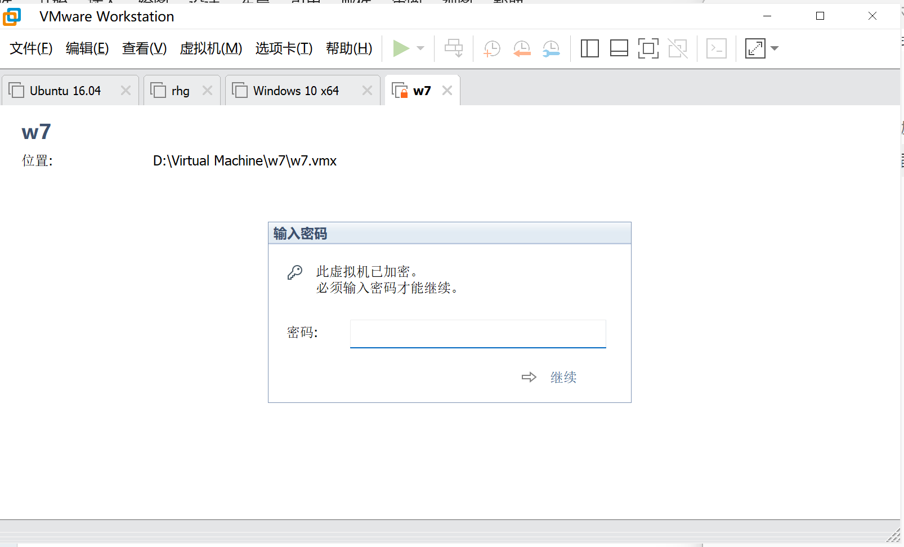
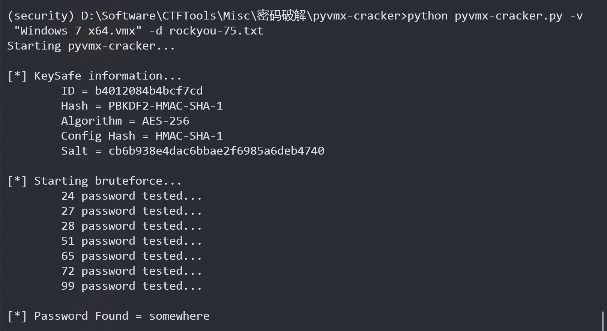
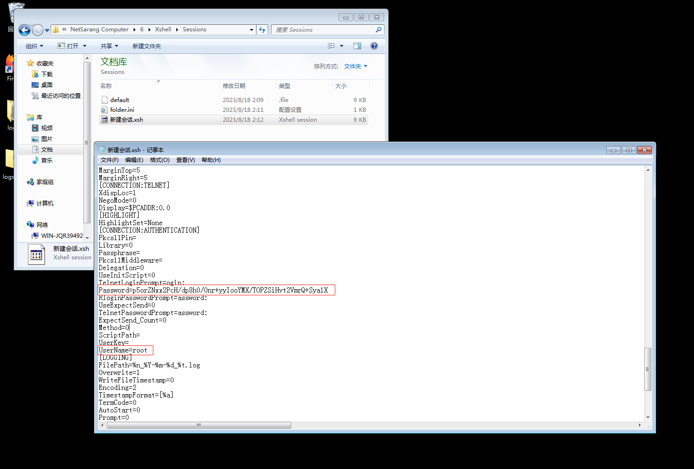
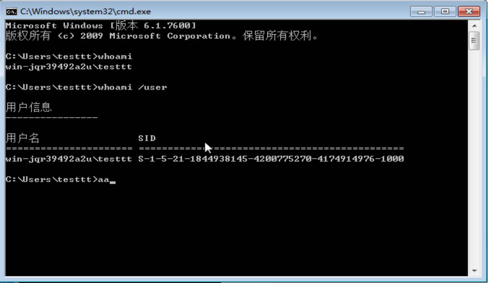
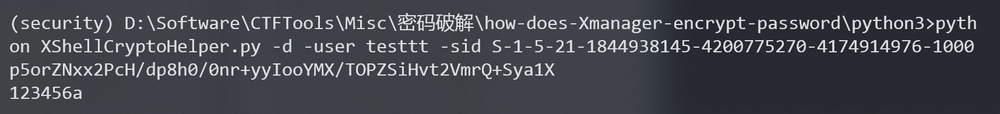
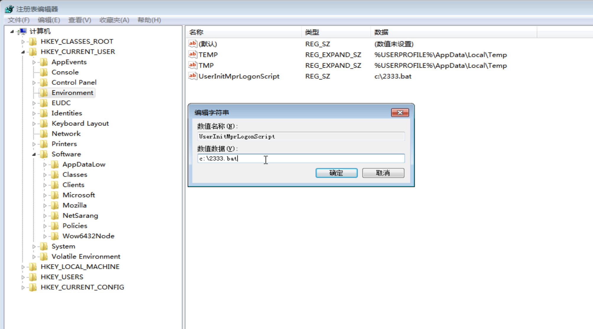
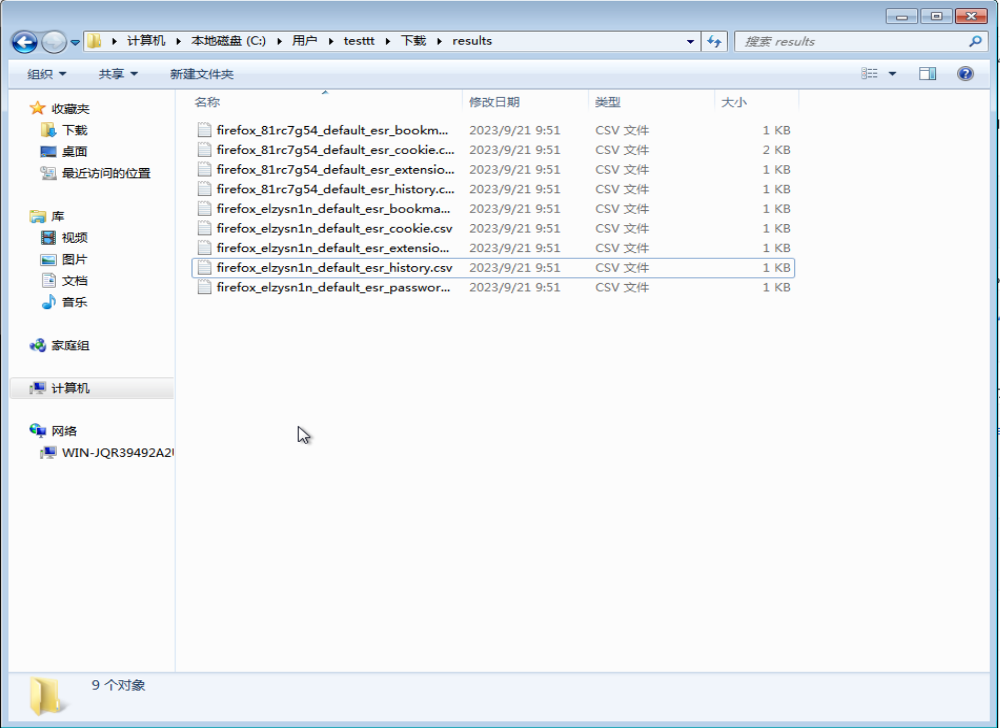
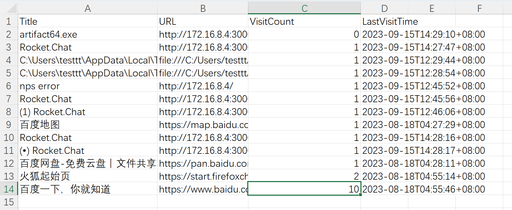

# win

```
@Name	: win
@Game	: 2023 第二届陇剑杯决赛
@Time	: 2023/9/16 
@Type	: Misc
@Description：
1. 小明在一台电脑中获取了一个虚拟机文件以及桌面上存有 rockyou.txt，打开虚拟机的密码是多少？
2. xshell 连接的密码是多少？
3. 登陆脚本启动的程序路径是什么？
4. 共访问了几次 www.baidu.com？
@Flag：
1. somewhere
2. 123456a
3. C:\2333.bat
4. 10
```

## 知识点

1. vmx 文件爆破
2. Xmanager 加解密
3. windows 权限维持
4. 浏览器数据取证

## 工具

- pyvmx-cracker：vmx 文件爆破 https://github.com/axcheron/pyvmx-cracker
- VMwareVMX：vmx 文件解密 https://github.com/RF3/VMwareVMX
- how-does-Xmanager-encrypt-password：Xmanager 密码解密 https://github.com/HyperSine/how-does-Xmanager-encrypt-password
- HackBrowserData：浏览器导出解密 https://github.com/moonD4rk/HackBrowserData

## 前置知识

VMware Workstation 的加密功能是不可逆的高强度加密，具体操作步骤：

新建一个任意虚拟机，然后点击“编辑虚拟机设置”→“选项”，可以看到“加密”，提示“该虚拟机未加密。你可以使用密码保护该虚拟机的数据和配置。”

虚拟机有一些配置文件：

```
Windows 7 x64.vmdk		//VMware 虚拟磁盘文件
Windows 7 x64.vmsd		//VMware 快照元数据（存储密钥）
Windows 7 x64.vmx		//VMware 虚拟机配置
Windows 7 x64.vmxf		//VMware组成员
```

加密前的状态：

```
Windows 7 x64.vmdk		//正常
Windows 7 x64.vmsd		//空白
Windows 7 x64.vmx		//明文配置内容
Windows 7 x64.vmxf		//明文配置内容
```

加密前的vmx文件：

```
.encoding = "GBK"
config.version = "8"
virtualHW.version = "20"
mks.enable3d = "TRUE"
pciBridge0.present = "TRUE"
pciBridge4.present = "TRUE"
pciBridge4.virtualDev = "pcieRootPort"
pciBridge4.functions = "8"
pciBridge5.present = "TRUE"
pciBridge5.virtualDev = "pcieRootPort"
pciBridge5.functions = "8"
pciBridge6.present = "TRUE"
pciBridge6.virtualDev = "pcieRootPort"
pciBridge6.functions = "8"
pciBridge7.present = "TRUE"
pciBridge7.virtualDev = "pcieRootPort"
pciBridge7.functions = "8"
vmci0.present = "TRUE"
hpet0.present = "TRUE"
nvram = "Windows 7 x64.nvram"
virtualHW.productCompatibility = "hosted"
powerType.powerOff = "soft"
powerType.powerOn = "soft"
powerType.suspend = "soft"
powerType.reset = "soft"
usb.vbluetooth.startConnected = "TRUE"
guestOS = "windows7-64"
tools.syncTime = "FALSE"
sound.autoDetect = "TRUE"
sound.virtualDev = "hdaudio"
sound.fileName = "-1"
sound.present = "TRUE"
cpuid.coresPerSocket = "1"
memsize = "2048"
mem.hotadd = "TRUE"
scsi0.virtualDev = "lsisas1068"
scsi0.present = "TRUE"
sata0.present = "TRUE"
scsi0:0.fileName = "Windows 7 x64.vmdk"
scsi0:0.present = "TRUE"
sata0:1.deviceType = "cdrom-image"
sata0:1.fileName = "E:\迅雷下载\cn_windows_7_enterprise_x64_dvd_x15-70741.iso"
...（省略）
```

加密后的状态：

```
Windows 7 x64.vmdk		//文件数据改变
Windows 7 x64.vmsd		//增加密钥
Windows 7 x64.vmx		//配置内容加密
Windows 7 x64.vmxf		//无变化
```

加密后的vmx文件：

```
.encoding = "GBK"
displayName = "Windows 7 x64"
encryptedVM.guid = ""
encryption.keySafe = "vmware:key/list/(pair/(phrase/tAEghLS8980%3d/pass2key%3dPBKDF2%2dHMAC%2dSHA%2d1%3acipher%3dAES%2d256%3arounds%3d10000%3asalt%3dy2uTjk2sa7ri9phabetHQA%253d%253d,HMAC%2dSHA%2d1,qipjap5UguTA5Evy1dipkNaW4xEtjoc9dkjcLKCXxOY1AK8GBi25tkYmApN98B6LuusWn%2b3hSLgJacDobycflOpwa%2bmw3xt%2fvnVT47asYLDXExOtjEiB6%2bGhU32CXMiD8bwkSp5f4IiKC62i2pn1BYgRRws%3d))"
encryption.data = "Oo3FlZJquP2Km+9sibWZ5tTKGcHdMqt15lnsOx3fHDhsG/l5kFYJ5ikHUZY4...（省略）"
```

## WriteUp

### 1. 小明在一台电脑中获取了一个虚拟机文件以及桌面上存有 rockyou.txt，打开虚拟机的密码是多少？

题目提供了一个 Windows 7 x64 虚拟机，导入后提示，虚拟机已经加密，需要输入密码：



提示桌面上存有 rockyou.txt，这个应该就是爆破字典了。打开虚拟机配置文件 Windows 7 x64.vmx：

```
.encoding = "GBK"
displayName = "Windows 7 x64"
encryptedVM.guid = ""
encryption.keySafe = "vmware:key/list/(pair/(phrase/tAEghLS8980%3d/pass2key%3dPBKDF2%2dHMAC%2dSHA%2d1%3acipher%3dAES%2d256%3arounds%3d10000%3asalt%3dy2uTjk2sa7ri9phabetHQA%253d%253d,HMAC%2dSHA%2d1,qipjap5UguTA5Evy1dipkNaW4xEtjoc9dkjcLKCXxOY1AK8GBi25tkYmApN98B6LuusWn%2b3hSLgJacDobycflOpwa%2bmw3xt%2fvnVT47asYLDXExOtjEiB6%2bGhU32CXMiD8bwkSp5f4IiKC62i2pn1BYgRRws%3d))"
encryption.data = "Oo3FlZJquP2Km+9sibWZ5tTKGcHdMqt15lnsOx3fHDhsG/l5kFYJ5ikHUZY49Sjq1cErSEDioIt+VD65gAjId/NqxOUBuZxKCP7+/LAzI2vs5T+a7yOPO7LxM5GtR2sUeWv5fhtyhUqY/QCuHGTxZl4DviXmLYqMgBMyUqnERoXI3pg1PBEmIyaPGKnvrcl8eE+vF4bpp/rYojAffovQNWwPonvG5ghtYOix4XMsiBmGuxeGHj9C5i3GwDzCkrWDb2DGYO4HXpZNiSSvUezvf+aqBPBMA2Vn9X3nuGW97Ij8HQ9jQnMFeZ2yWlWuuFu1XYsKTjfjiYL5esNgAsycnWMD/1a2wYBGab/SuBSqnGxHh441OBjC3oXjGLRMNJRFQVRBHvnw5KGYhzKdX51CaS8axziFKLjZHcBdJu9uPSJuigFEhg0S9hwlUd7skN+qXXGdG9XRAg3P8s8LucwiEJgX7rAxxUoVeSPsO/Tm2wvUqtLoEUM4YL16N5Vc692sqUitu5muq1cqjrijEt2q+SwesaLe8rM2LtAnZ/HafUXbw5hqLhwwEaHywLI/RVynA6aDgxWxOIPGqK3uetjQo6L/AZO7AXxoWqU68OYmuffiXsELGPr+weuNKkq+lUCWejuFVfKdsoSMuD3ZkB1WTMoSyvDcfqYuHzTzeNqbQvb2l0y7SwLlI1QA6qtByRlhuVKOWWQuLXFFYCuFt+oKNWE233fDoDJ8Psvb71bef7VqroLDQMvqyyiG4HrcAJNFgIg8W37d0NxNsonWc2SibJyxILGd4692ihU5xwsM3oOy4HcRd65rZsyABq5GD0RII9RX7mHpsQqS3qaunw8PyZf4TDYN8NdnbLMRS1/mpEDbtrgk4ILz0MFQhAyuVLILopHxwXmcmW79/+kvHktxUzA4/bWg++8GXicWF6h6xAh2KCWElOsulUlXjogOBBsvtpRS7gbNrrE1koZZDJNOtiM9v9HWCEC67L+cMSB7gcs9QctccWvPiziOEDk5dSF7hWRoyJRi8P4Nbsl+h8nuTTOUvEFqcWUgja6NFOvOYKSAYmrFK74aO1NwAz1OototoSHYgkx5KdQ71w7KLgjGjIw1BbORUMDMb9nhitE/w+8Kg9VR5PkgyhpKw3lJFQL46Q2MEaLg1dDXysvnHvyqFgxIDH8tvX696jhw5dcCsSFO5EFAFxXM3qlDqUNmqAbW3dWxUkNidAb+uxU0YAjFE7bBqVj5XXu8A0HTM55nAwAvaeb3dF4l211FVnWwQiV4UCSeR9fwMT4IF4xunFLh9RaGjWfPYSV24RcQoy/qax3SRBoqHU2kLs7LZD0rdf0e5WT8uFBGI0smkQHUXHDVOYW/ZkbxcRHspieqJTkPr7w98vXle3S9lNmhqiB65Klg/FNIwXdZvKA2RkY/ATc7LjSUr1sWyZp/2qvK1+Buq6Kf1BA9DsR+WnnrGz3BSxSzG/8h2wbCCT+TciucR5mCPGviKBWOrb36YyRG9rJ/odFroKCh7vEzzWs8G3cUl1bFsWI1m3Xw4ZBb99H5viS7+VcXoibfLZXtSP7d99brAZ3FbW6MVmtukj+MqwQnKeTWkeo8lKGC4O+G5+4DfnJDHSUaLrsT1H3ivubkEnCevBeZtfFbHqV1H5oO6vRc0nW8mvqL4DC4Ow1mJM+3drRxrsBwRdL+PALCCVE+7aDx0z4I48TFhp0BKuFmgeqmTG1uAjHwbqUeU3V5ipc5CdBOyyA9qAqMDpKzOSSmP+mwNj5Mk980tm64QLTdHqMX08JSj37DQPUR14yQ9BphHdzlD81Gq5uV51YI4Af6Mb4hn+6AxBsgIZ4rUYucqk2lAK2oW4IPwY502NjyLKLcpi4CxhEy50lKBkFNhKByKxg2NK6ZKiUhO6Ac+gWnjdY6hTU+d1N6SoQhHWG2DfmqtNO9+al9jSa35KXStsZkPoAMlcCnHzlSUNNRJckrnEgMiVLMMyTbV/I+CdayNbL0JjQFQgXeJOHg8EEI9BoGD8hMCVi4GtElkLDGAi0mi7erZPAok2zYTV1u5KYbd6x9FoFmUiJnN+e+ELRTThcMIhhqio8qPttc94vXrRz0lCRhMjbnzTnQHyOAio2FapfJGqi9Q99fKTFVLmbsxfF4T0pAkJruK+3ZjLbfZdyGL89I+ypI2XwgFk0vYAop9RCKOLnQEYzD7CH5c5O2FbkrDlPIsm0NurCECjmWx4vnB8GPs3Nrd7NrZdlywcBUZd4Qs4e+eZXKkAHHfcAZrwFgTgvAt7lOhrufO4TcNtkc9lQnuc37/CjRrHFvYZwQihtpTYVxHqA2mVLA4SluMlpufcRFyD0NgYZIAN2K6FRT9NgNT9xMFrGZEZPwodWFrjaB3x32ovEeASN2ddAOx4rvn8cIyOQY6YE6p2Oj6MnIPxmRlxieXF5AdJv6XZ4he7bfPuQhCDIWsqBzPZmoUgUh4+deYLx1Ac8DJctt0uSqzwmw/zy6Zt2ipZWmP17Nn845hBRbKdBf3gPqpON7XhoUOcQsCict4RVmzGuKNHZ7E5aEVPGC8oRNFYrDqU2HbdMWr78NW7h69mhzAiS0xol2Vcl4Me5K0Wzn6DK9Djd+1t8mrrt8H2bqSFZPg9PJJtfbQ4J1T8FfYldssShc3ISLQxhIaGmW1fUhu2etftYnWjW4v8PQ91X17HAzhZCh7PmIsyXO3I4EWLay/S1vrlPcOYOcihWrzK9y3MuO4oF+a2saF18HeowWwqpYCFEF2TCZ2M8TaZw3DsCMWQfQOCdZGHFbFzp6SBL/X1ZlEZ4OoFAOJB3qxe9E1ZeeIRbVxxbptRM6sSzHRSopb8+HexwYQOroHsXoCruj5E0jRCkpLl6Hmi4Nl4lpjoVG5dWE0OiiO4ep1D0Ri69PLYh2r/x1XV901NHRk3Z/+W7XpseRCw7Y8glqkb6xX/sBBNbvbw5c/fDqIOCJ89rkZAyAxwUCqYZ+dIaomYDiqFD8YvgEYFMvGyU50RFyqbahOBSWI8Jbbx0A+lIApdCJB1TWPCja9EGK/rOstehvC0edvZMTVEKthTsv4+qGfWpRl3+igS3OB+RDej6SLH3Z0IV4fF2wgLW37PYi7Pu2cZvf0aPy6YKwMP3tZBqJEwpGoat8MmFO/eNCi4q2d8rOhHPZVV1qOwOoOI0AK+nQc1HxX/Sh8fJMWU969vJFMhbOfsXVmnnX7jnkzYloxPItnjG72pbWHs+tSdp2iS/dP0wZz5Iv47h1nf6wJsRafTkJdIVScJSGi/9sbLfDMIXy5vO9v0zfWDdXrrsix2aa/LTeZRXLKDovebcR26ov+LUd+59/7n6moSjXz6XFaksydJhUNuGCv6NKst5EmO370tTWErZAsbrnlrcMchPojQszmY7ChCWewDdV45Stp6YxIrTplR6/p9um2321OneQqmBut2mZl2un6C5jiAsWhosYYUno+ReDx4ihKvbqsQsZ7lx9iubeDkvCMrLuTeyHLeOOSDvLT3vgoMgB050/6eP5pXu2kh7a7fSlpXqpHnWKRLKigSbSPpuJ+Out2UVLqQxCRyVlFbtej8lzlFfDB4a3NRMzVFXZJ8paA527kwR8Zyx+4K/kdzzel6pXBAsyV7J6b3R79QLzhz6oABqqfOpcXQTcumPhkt6Ip/HJPLft9NXWJquFp50jLntWxtx3HggKq3RR1eF9ksPWitGPUVXgtOzepW6ZdaAHBjZRURwo73vPy58nZj7gSzq2IZccrr+cTiwEM4PfpFsWKP5d6bMc+952iPwSA/pzC53Xnn/DdC/hMLECKbhV01jEEx4w0SjOymhZkWIWJ3lacFjl8MU3OAl1+sBBRP4EyaifeVGhSMPIaZWM+uTnXTCxdTWybLyJSZ7MT0HIiUAaoVRWADU7jK6AF36FKVxfI5sE5mjQvXA4tyut2H1rjxLrcuH7a42pIvx3/CKabh5uYsgKpf6ROfnNabxtOVB1jdBJLv6uZqfPex+mg4/50RSF3TQhbsFR6wRF/zXHjSWQPhuFV0MaLqAPj+u8stNiEV1pT27lsnOYxggQj6ZyMhSvP2qPsJRWiVHyAtBobw51mOjLiL1JYlf5lIMmm4dKbwia0uqcvcJ2K0IlS4CiszO8PKpRh0Jr9ZxPLPbE35vyxak16S/+CTm2293IMJuFNk0fB15DluM8Q0S45FmQnYgCQ+TVelwlRFyI6IwMDEHs66MJlCiJvm2WgKC9P0NIRCOxK6o9A0nyQ2P3E3dmV+cGHHvEjejVQFVhZFYB1Mv7ZLT2Zgj1qaCPzUzRvKX2Vpc+RQ36wRD/dnA4KYCKCYmXXjttX7BDwqUO5hyYSPtHPVo6ssUCnflbG132fBo5/bAOPW1oKewbHfQFJ7DwgnABxdE2kvOqtIpG7cufvpV9tWKIJzw5LnlfVVT4137EGyYx7ZwIxshWcA2E9pb5qC0lEdFmCYoOB5GiPDe79TU0LFSkfkiY7Z0KYKbS7GdioF10qbniUNiL5ActuXpUrmBvDiXjmlrt0ANDqg3WDXuql5ZwkqzjGH0NdMD16ermHHdedMsx4+k+khVT6txf8D75o04p5UcGJHY1jBsMmLWQdTAElWx1bKVl/F7tJsG9JB11mFev6OkZ8dnFWTZEi4oW7Fnqd/6SGt7H9gnu6Ni1pLik9L/BI92sQS99xylqIlDpfaCjrUR4h0DPKI8QxSbnZTmOFvTMNptAs0/YvxD51IBQX78NAf9FqZtD3vyienmoymUDX8G/T1QNA9T5D+Ph4I1n+IsUtpzV9UeBskugxtoM6mSiAPdTYyeB8II5hTK1ag6M2L5yDrUkp6be82/m9qoBKGEuvS0YsyzC1eLK65rWWxx1/KeTp3MwNBplneJUvjvyVi7oafGJ6686EgPidIX9C7ICdWpbtFSlo9f+yjOy7AN5+uWgc7NfDIof8NBFM7Q="
```

其中，还原 vmsd 文件需要：

```
encryption.keySafe = "vmware:key/list/(pair/(phrase/tAEghLS8980%3d/pass2key%3dPBKDF2%2dHMAC%2dSHA%2d1%3acipher%3dAES%2d256%3arounds%3d10000%3asalt%3dy2uTjk2sa7ri9phabetHQA%253d%253d,HMAC%2dSHA%2d1,qipjap5UguTA5Evy1dipkNaW4xEtjoc9dkjcLKCXxOY1AK8GBi25tkYmApN98B6LuusWn%2b3hSLgJacDobycflOpwa%2bmw3xt%2fvnVT47asYLDXExOtjEiB6%2bGhU32CXMiD8bwkSp5f4IiKC62i2pn1BYgRRws%3d))"
```

两遍 URLDecode 得到：

```
encryption.keySafe = "vmware:key/list/(pair/(phrase/tAEghLS8980=/pass2key=PBKDF2-HMAC-SHA-1:cipher=AES-256:rounds=10000:salt=y2uTjk2sa7ri9phabetHQA==,HMAC-SHA-1,qipjap5UguTA5Evy1dipkNaW4xEtjoc9dkjcLKCXxOY1AK8GBi25tkYmApN98B6LuusWn 3hSLgJacDobycflOpwa mw3xt/vnVT47asYLDXExOtjEiB6 GhU32CXMiD8bwkSp5f4IiKC62i2pn1BYgRRws=))"
```

使用工具 pyvmx-cracker 和字典 rockyou.txt 爆破。

该工具需要修改注释掉 pyvmx-cracker.py 的第 108 行、109 行代码，否则会报错。题目中第三行是 encryptedVM.guid，也可以将 vmx 文件中的第三行注释掉。

```python
if 'encryption.keySafe' not in lines[2]:
	sys.exit('[-] Invalid VMX file or the VMX is not encrypted') 
```

实际上的字典比较大，此处仅为示例。执行命令：

```python
python3 pyvmx-cracker.py -v /YOUR/PATH/TO/VMX.vmx -d /YOUR/PATH/TO/ROCKYOU.txt
```



得到密码为 somewhere。

可以使用 VMwareVMX 对 vmx 文件进行解密：

```
python3 main.py /YOUR/PATH/TO/VMX.vmx > /YOUR/PATH/TO/DECODE_VMX/decode.vmx
```

也可以直接输入密码，或使用解密后的 vmx，打开虚拟机进行下一步操作。

还可以通过VMware Workstation 移除加密，”虚拟机设置“→”选项“→”访问控制“→”移除加密“。

### 2. xshell 连接的密码是多少？

一般来说，xshell 账号密码文件位置如下：

```
Xshell7	C:\Users\%username%\Documents\NetSarang Computer\7\Xshell\Sessions
Xshell6	C:\Users\%username%\Documents\NetSarang Computer\6\Xshell\Sessions
XShell5	%userprofile%\Documents\NetSarang\Xshell\Sessions
XFtp5	%userprofile%\Documents\NetSarang\Xftp\Sessions
XShell6	%userprofile%\Documents\NetSarang Computer\6\Xshell\Sessions
XFtp6	%userprofile%\Documents\NetSarang Computer\6\Xftp\Sessions
```

本题中，xshell 账号密码文件位置如下：

```
Xshell6	C:\Users\testtt\Documents\NetSarang Computer\6\Xshell\Sessions
```

.xsh 文件中包含连接密码：



当前用户名和sid：



解密得到 xshell 连接的密码 123456a

```
python XShellCryptoHelper.py -d -user testtt -sid S-1-5-21-1844938145-4200775270-4174914976-1000 p5orZNxx2PcH/dp8h0/0nr+yyIooYMX/TOPZSiHvt2VmrQ+Sya1X
```



另一个思路是上线本地cs，直接 dump 密码。

### 3. 登陆脚本启动的程序路径是什么？

镜像启动会弹出一个 calc 计算器，所以首先需要排查开机启动项。

查看 Windows 启动开机启动项，发现 C:\2333.bat

```
C:\Users\testtt\AppData\Roaming\Microsoft\Windows\Start Menu\Programs\Startup
```

进入注册表查看，发现攻击者创建了 Logon Scripts，以优先启动攻击脚本。注册表路径：

```
HKEY_CURRENT_USER\Environment
```



登录脚本启动的程序路径即为 C:\2333.bat

### 4. 共访问了几次 www.baidu.com？

用 HackBrowserData 获取历史浏览数据 firefox_81rc7g54_default_esr_history.csv



访问了 10 次百度：

